

*   [Shellac disc](#mozTocId644389)
    *   [1CL0064565 - Distorted audio. ](#mozTocId33036)
    *   [1CL0065860 - Cracked Surface of the disk.](#mozTocId323699)
    *   [1CL0065854 - Shellac disk surface noise.](#mozTocId199805)
    *   [1CL0066809 - Worn out groove.](#mozTocId199805)
*   [Open reel and compact cassette](#mozTocId976562)
    *   [C1163/87 - Changes in speed on open reel tape.](#mozTocId835696)
    *   [C1829/864 - Pitch increase towards end of the tape caused by battery failure](#mozTocId424975)
    *   [C1734/275 - Tape flutter.](#mozTocId424975)
    *   [C43/14 - Tone inerference on open reel tape.](#mozTocId563217)
    *   [C613/88/15 - Buzzing noise and feedback on compact cassette.](#mozTocId400562)
    *   [C613/79 - Hiss and hum.](#mozTocId567114)
    *   [C143/1 - Open reel recording with buzz.](#mozTocId694479)
*   [Digital formats](#mozTocId129700)
    *   [CC203/833 - Digital distortion broadband clicks.](#mozTocId548493)
    *   [C203/530 - Dropout on DAT tape.](#mozTocId330086)
    *   [Transfer dropout.](#mozTocId949223)

# Shellac disc

## 1CL0064565 - Distorted audio.   

<audio controls=""><source src="distortion.mp3" type="audio/mpeg">Distortion audio.</audio>

The audio was distorted at the recording and sounds very saturated.  
Waveform does not look "squared", but show very limited dinamic range and additional frequencies at the waveform peaks. Spectragram shows more harmonics than expected in a speach recording.  
      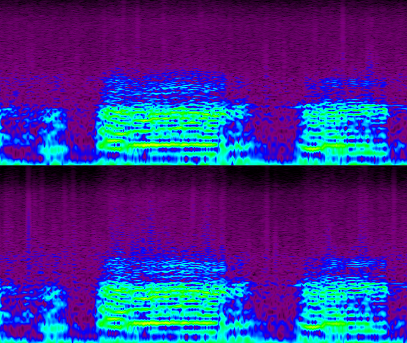  
[Back to top of the page](#top)  

## 1CL0065860 - Cracked Surface of the disk.

<audio controls=""><source src="cracked.mp3" type="audio/mpeg">Cracked Surface of the disk.</audio>

Regular clicks in the audio.  
Two out of phase clicks appear at regular intervals and are clearly heard and visible. Clicks have wide frequency spectrum.  
   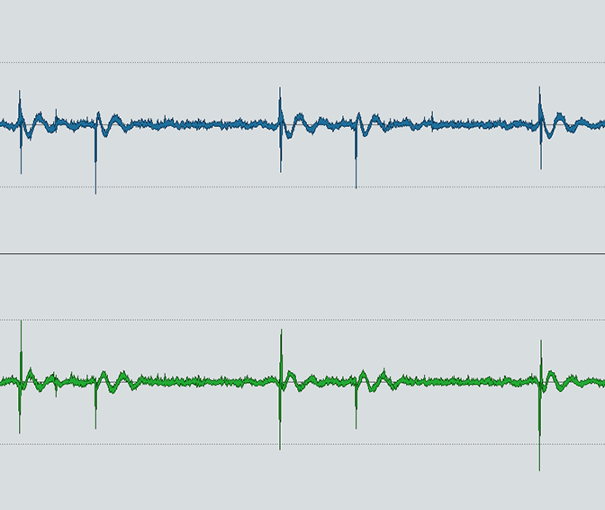     
[Back to top of the page](#top)  

## 1CL0065854 - Shellac disk surface noise.

<audio controls=""><source src="frying.mp3" type="audio/mpeg"></audio>

The surface noise on shellac disc sounds like continuous frying/sizzling noise. It is the result of the addition of abrasive fillers like emery powder which were used to provide resistance to wear from heavy pickups.  
The noise consists of the series of small irregular clicks visible on the zoomed in section of the waveform and has typical “fire-like” spectrogram appearance.  
      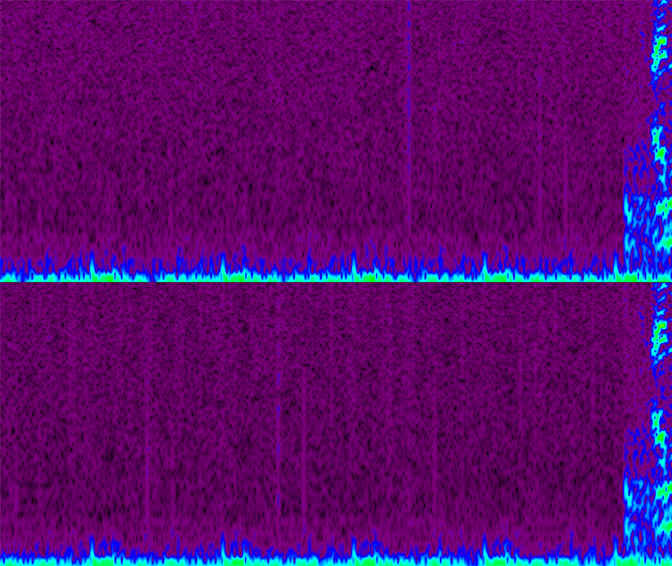  
[Back to top of the page](#top)  

## 1CL0066809 - Worn out groove.

<audio controls=""><source src="worn_groove.mp3" type="audio/mpeg"></audio>

Distortion accuring due to excessive wear of the groove.The distortion is visible on the zoomed in section of the waveform and has specific frequency blueprint.  
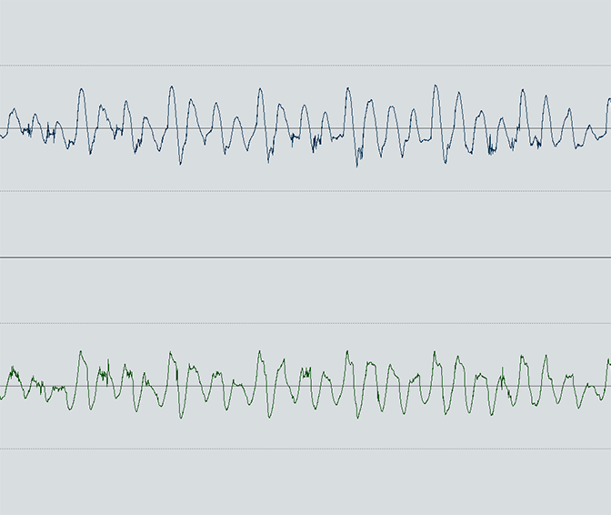   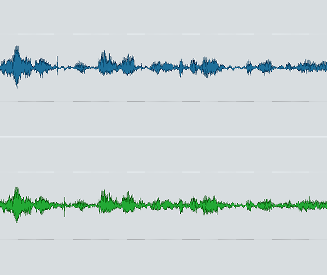     
[Back to top of the page](#top)  

# Open reel and compact cassette  

## C1163/87 - Changes in speed on open reel tape.

<audio controls=""><source src="speed-normal.mp3" type="audio/mpeg">Speed normal</audio>

<audio controls=""><source src="speed-variation.mp3" type="audio/mpeg">Speed variation</audio>

The first audio clip recorded at normal speed. In the second clip the tape is sped up and then slowed down.  

Speed variations are difficult to see in the waveform view. Spectrogram on the other hand is very useful for detecting gradual changes in pitch.  
       
[Back to top of the page](#top)  

## C1829/864 - Pitch increase towards end of the tape caused by battery failure

<audio controls=""><source src="battery_running_low_normal.mp3" type="audio/mpeg">normal</audio>

<audio controls=""><source src="battery_running_low_increase.mp3" type="audio/mpeg">increase</audio>

The first audio clip recorded at normal at the beginning of the tape. Towards the end of the tape the recorder battery is almost empty, which results in tape speed decrease. When played back on a normal playback machine the audio appears to be sped up.  

9kHz frequency tone at the normal speed recording is an artifact probably introduced by a a recording machine or radio interference. Tracing this tone in the spectogram of the second audio allows to follow the speed increase.  
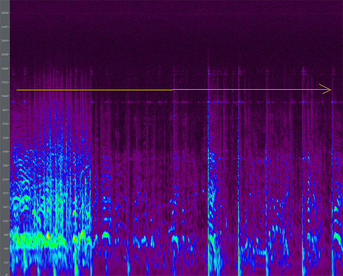       
[Back to top of the page](#top)  

## C1734/275 - Tape flutter.

<audio controls=""><source src="flutter.mp3" type="audio/mpeg">Tape flutter</audio>

The first audio clip recorded at normal speed. In the second clip the tape is sped up and then slowed down.  

Speed variations are difficult to see in the waveform view. Spectrogram on the other hand is very useful for detecting gradual changes in pitch.  
   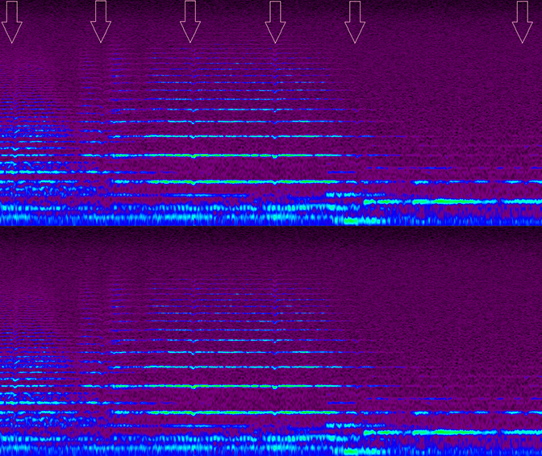    
[Back to top of the page](#top)  

## C43/14 - Tone inerference on open reel tape.

<audio controls=""><source src="two_tones.mp3" type="audio/mpeg"></audio>

Two tones aproximately 16kHz and 38kHz are clearly visible in the spectogram. The recording was made in 1983 in theatre "in-house system". It was transferred in 2000 on Studer player.  

The exact nature of the interference is not documented, but it is likely that 38kHz tone is introduced by the Studer A807 or A810 digital interface. It is well outside human hearing range.  
The second tone was probably added at the recording stage and it is likely 15.625kHz line scan frequency interference from nearby TV.  
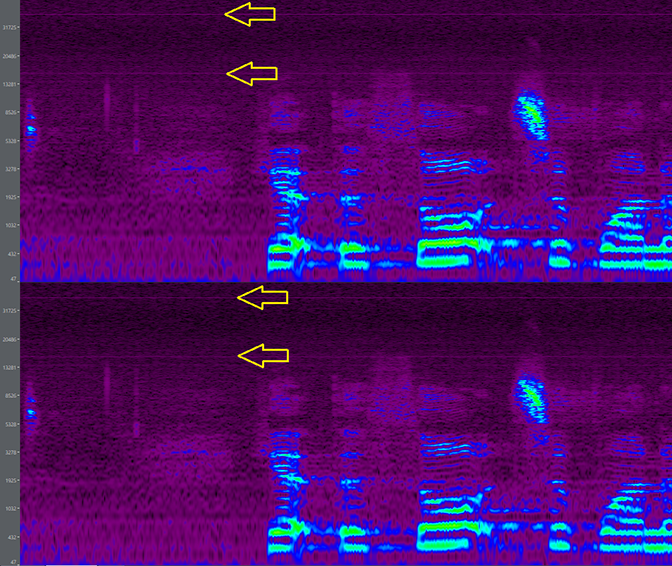    
[Back to top of the page](#top)  

## C613/88/15 - Buzzing noise and feedback on compact cassette.

<audio controls=""><source src="NoiseAndCrackling.mp3" type="audio/mpeg"></audio>

Live recording with loud noise that sounds like amplified recording equipment. Audio and zoomed out waveform show that the noise increases in volume, when there is no modulation. This indicates that the noise is the result of microphone feedback.  
Spectrogram shows the footprint of the noise. Zoomed section of waveform shows repetitive noise pattern.  
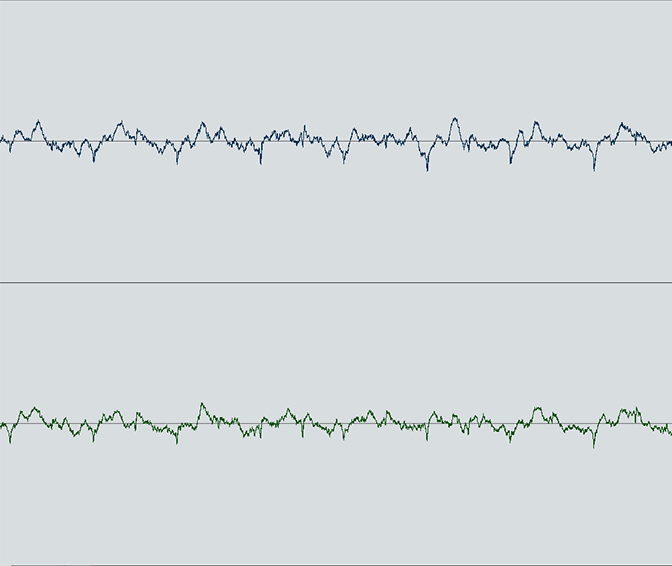   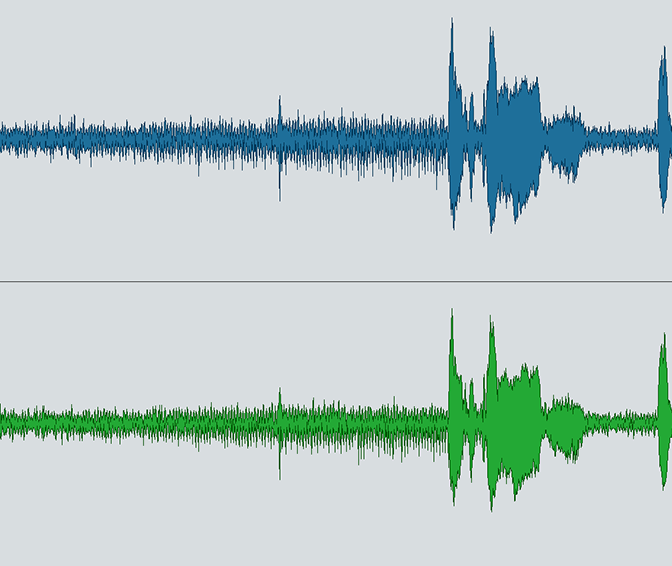     
[Back to top of the page](#top)  

## C613/79 - Hiss and hum.

<audio controls=""><source src="hiss_and_hum.mp3" type="audio/mpeg"></audio>

Waveform shows loud noise floor.  
Low frequency hum and high frequency hiss are clearly visible in spectrogram and zoomed out waveform.  
        
[Back to top of the page](#top)  

## C143/1 - Open reel recording with buzz.

<audio controls=""><source src="buzz.mp3" type="audio/mpeg"></audio>

Electrical buzzing noise extended to high frequencies is likely to be a result of interference or faulty electrical equipment.  
The noise is harmonic, which can be seen as multiple thin lines at the high end of the spectrogram. It can also be seen in the zoomed-in waveform as irregular series of short high frequency signals.  
   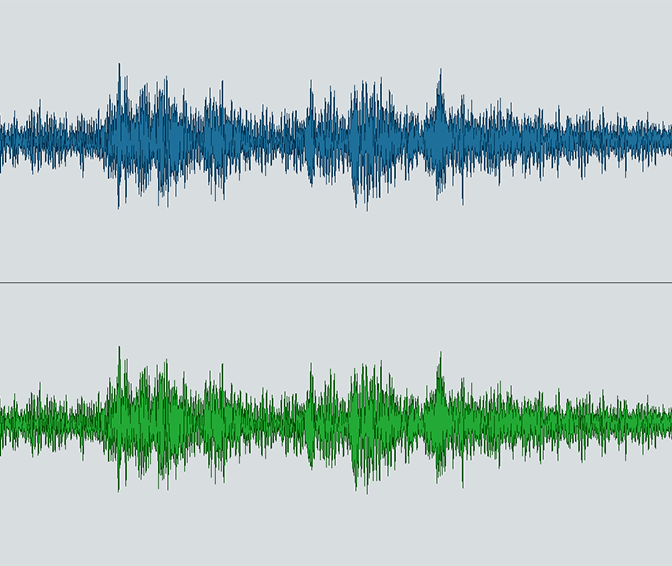   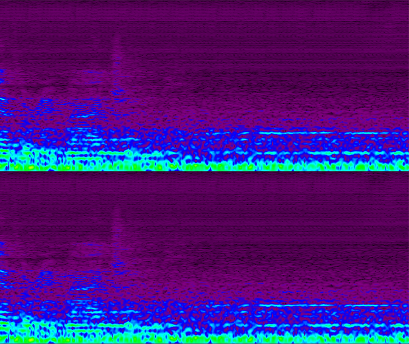  

[Back to top of the page](#top)  

# Digital formats  

## CC203/833 - Digital distortion broadband clicks.

<audio controls=""><source src="digital_distortion_clicks.mp3" type="audio/mpeg"></audio>

Two loud clicks are clearly heard and seen in the waveform view. They occupy the full frequency spectrum.  
Zoomed waveform view of one of the clicks shows consistent changes in level therefore it is unlikely to be a dropout, whereas, the group of samples at 0dB indicating digital distortion.  
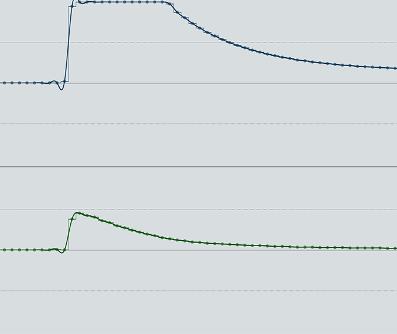   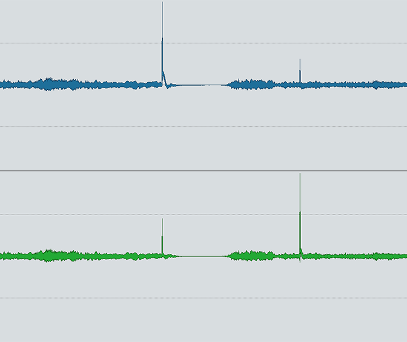   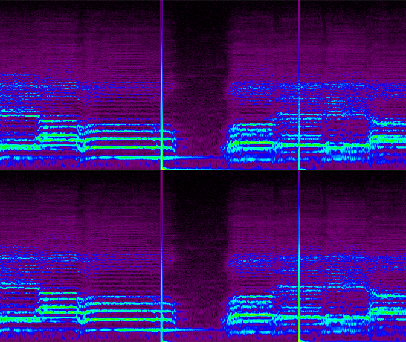  

[Back to top of the page](#top)  

## C203/530 - Dropout on DAT tape.

<audio controls=""><source src="dropout_dat.mp3" type="audio/mpeg">Cracked Surface of the disk.</audio>

Damaged section of DAT tape that cannot be interpolated by DAC algorithm is often replaced by digital silence. It is clearly audible and can be seen in both waveform and spectrogram views.  
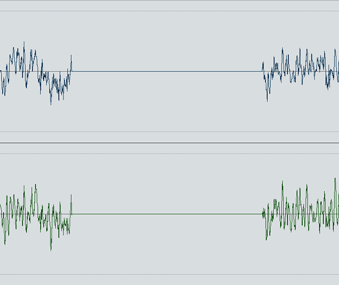   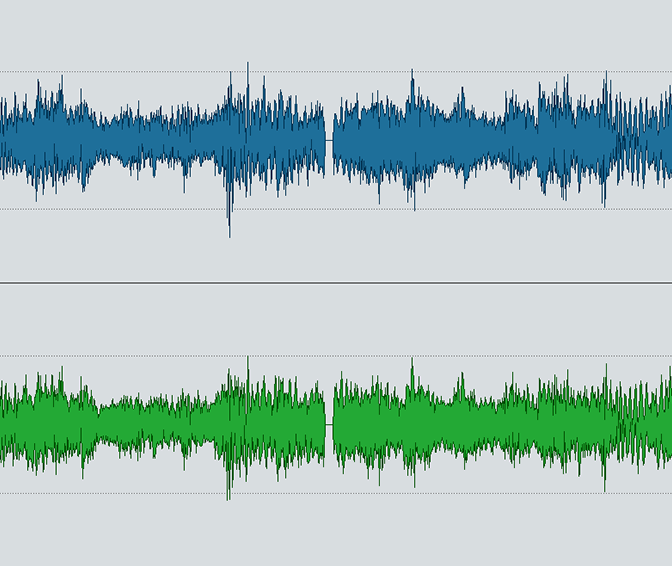   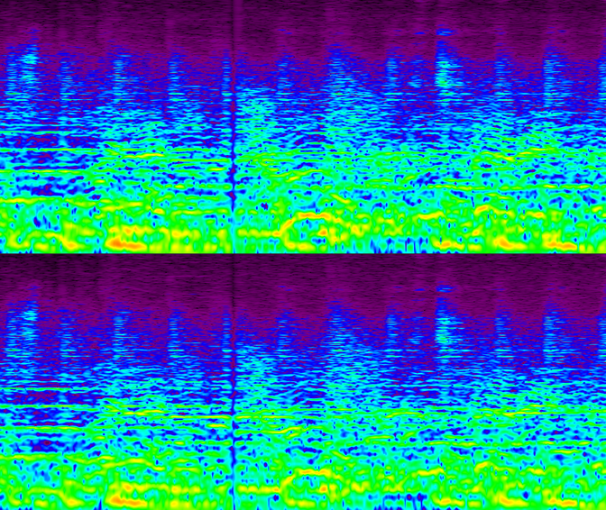  

[Back to top of the page](#top)  

## Transfer dropout.

<audio controls=""><source src="transfer_dropout.mp3" type="audio/mpeg"></audio>

Loss of samples during transfer. Can occur due to operating system background tasks, audio driver and recording software problems, etc.  
Dropout are very short in duration and can’t be seen in zoomed out waveform view. In zoomed in view the drop out looks like sharp level change between two samples. Although only small number of samples are usually lost due to dropout, the sharp change results in broadband click seen in the spectrogram.  
    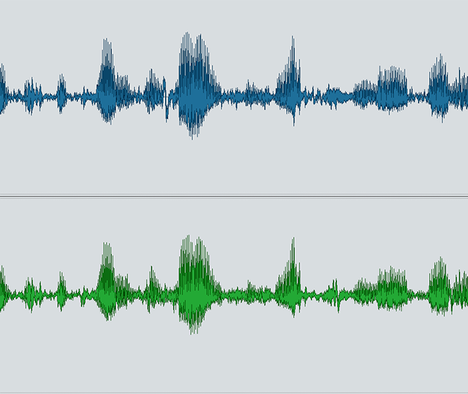   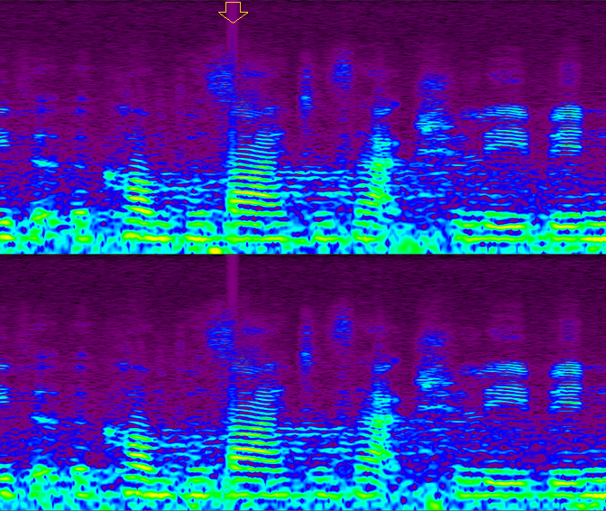  

[Back to top of the page](#top)
