# Save our Sounds – Unlocking our Sound Heritage
 ### Common Process Metadata Examples
_April 22nd 2020_
Gosha Shtasel
Gosha.Shtasel@bl.uk

*   [Preparation & Migration](#Preparation)
    *   [Open Reel Baked 2 Tr (Studer→Prism)](#2Tr)
    *   [4 Tr (Revox→Rosetta→Prism)](#4Tr)
    *   [Compact cassette (Tascam→Titan)](#CC)
    *   [Shellac or Laquer disk cleaned with Ultrasonic bath and Keith Monks (Technics→Elberg→Rosetta→RME)](#KeithMonks)
    *   [Polished CD-R](#Polished)
    *   [PCM VHS digital transfer (LG→Sony→Lake people→RME)](#PCMDigital)
    *   [PCM Betamax analogue transfer (Sony→Sony→Rosetta)](#PCMAbalogue)
    *   [DAT machine (Sony→Titan)](#DAT)
    *   [DAT DDS drive](#DATDDS)
    *   [MD digital transfer (via Sonic Stage)](#MDDigital)
    *   [MD analogue transfer (Sony→Rosetta)](#MDAnalogue)
*   [Capture](#Capture)
    *   [Wavelab recording](#WL)
    *   [Reaper recording](#Reaper)
    *   [Sonic stage (MD capture)](#SonicStage)
    *   [VDAT (SSD drive capture)](#VDAT)
    *   [dBPoweramp (CD capture)](#dBPoweramp)
*   [Editing](#Editing)
    *   [Wavelab general editing](#WLEditing)
    *   [Stereo to mono](#Stereo2Mono)
*   [Processing](#Processing)
    *   [PCM de-emphasis (for example digital VHS transfer)](#DeEmphasis)
    *   [Shellac Equalization](#ShellacEQ)

# Preparation & Migration  
## Open Reel Baked 2 Tr (Studer → Prism)

  

[Back to top of the page](#top)  

## 4 Tr (Revox → Rosetta → Prism)

  

  

[Back to top of the page](#top)  

## Compact cassette (Tascam → Titan)

  

  

[Back to top of the page](#top)  

## Shellac or Laquer disk cleaned with Ultrasonic bath and Keith Monks (Technics → Elberg → Rosetta → RME)

  

  

[Back to top of the page](#top)  

## Polished CD-R

  

  

[Back to top of the page](#top)  

## PCM VHS digital transfer (LG → Sony → Lake people → RME)

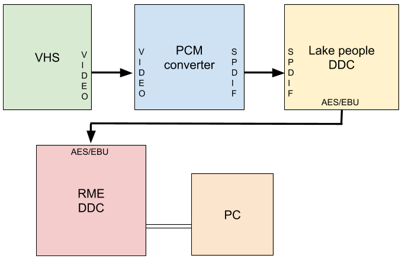  

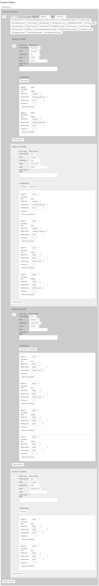  

[Back to top of the page](#top)  

## PCM Betamax analogue transfer (Sony → Sony → Rosetta)

  

  

[Back to top of the page](#top)  

## DAT machine (Sony→Titan)

  
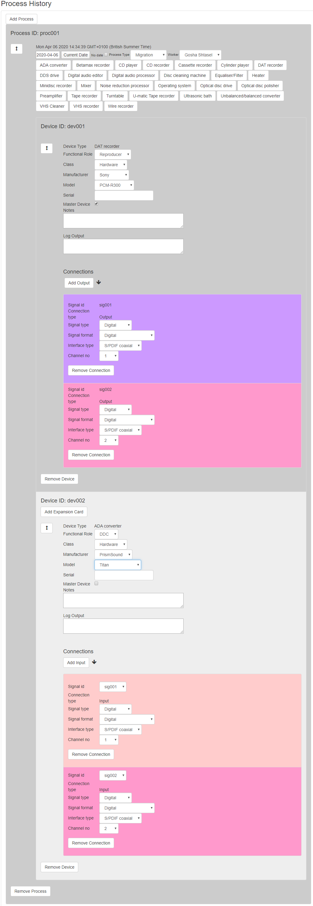  
[Back to top of the page](#top)  

## DAT DDS drive

  
  
[Back to top of the page](#top)  

## MD digital transfer (via Sonic Stage)

  
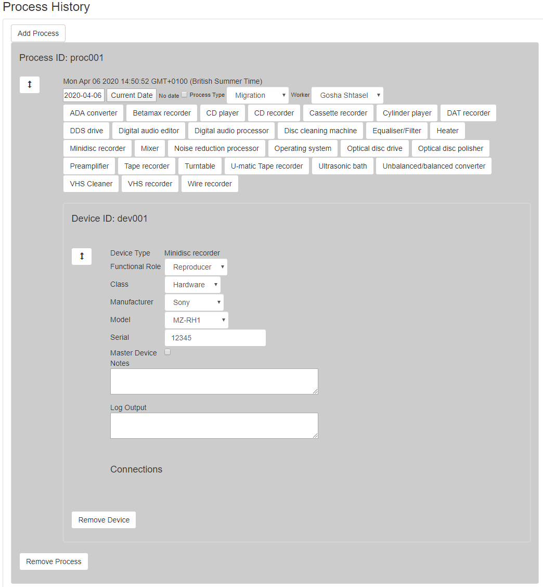  
[Back to top of the page](#top)  

## MD analogue transfer (Sony→Rosetta)

  
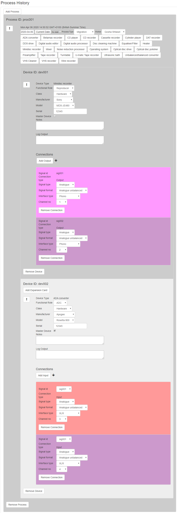  
[Back to top of the page](#top)  

# Capture

## Wavelab recording

  
[Back to top of the page](#top)  

## Reaper recording

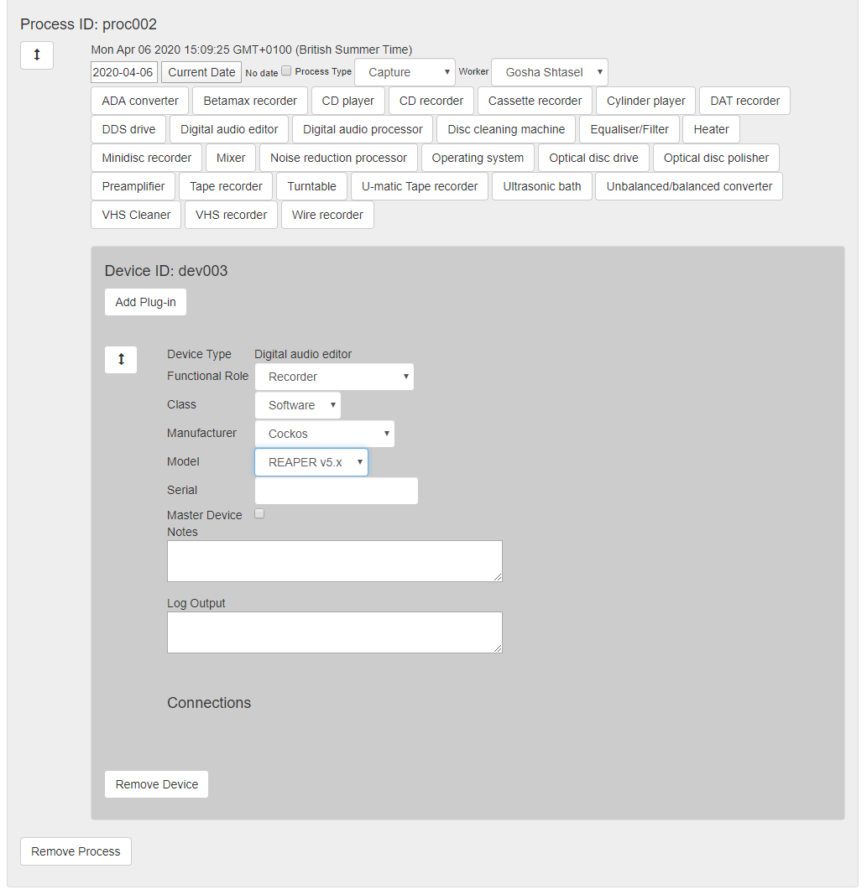  
[Back to top of the page](#top)  

## Sonic stage (MD capture)

  
[Back to top of the page](#top)  

## VDAT (SSD drive capture)

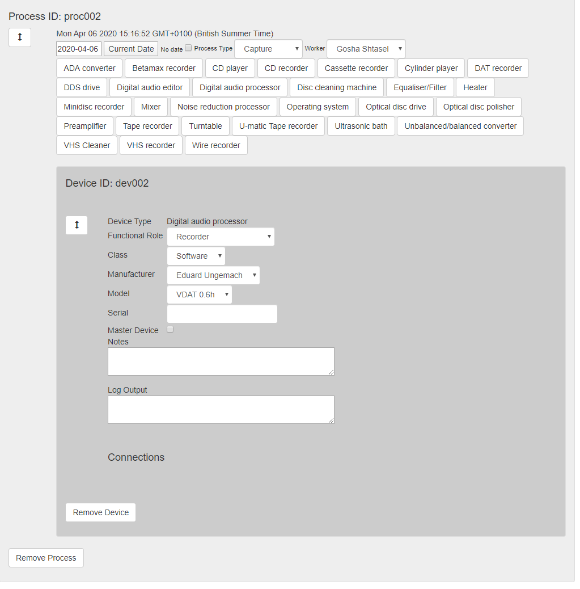  
[Back to top of the page](#top)  

## dBPoweramp (CD capture)

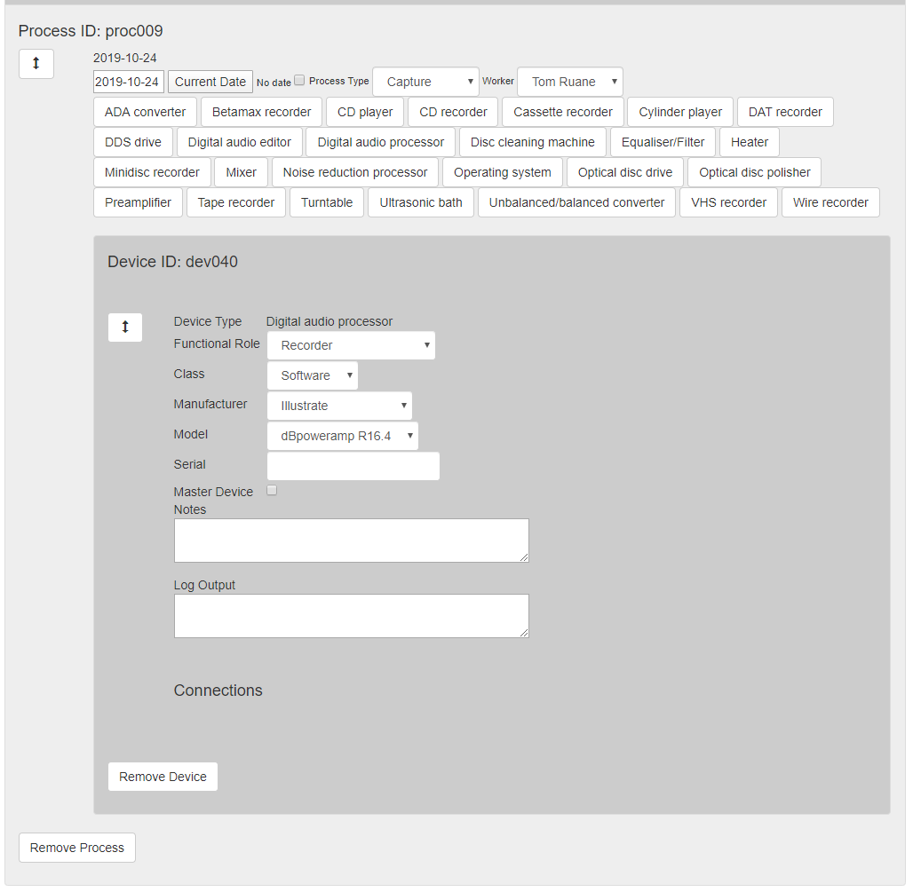  
[Back to top of the page](#top)  

# Editing

## Wavelab general editing

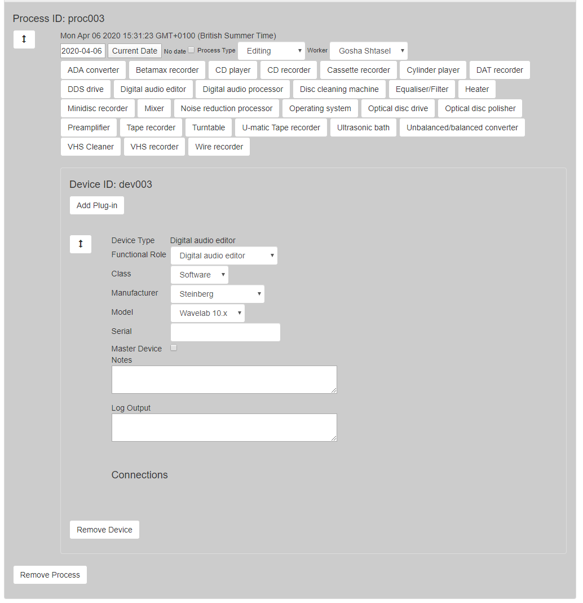  
[Back to top of the page](#top)  

## Stereo to mono

  
[Back to top of the page](#top)  

# Processing

## PCM de-emphasis (for example digital VHS transfer)

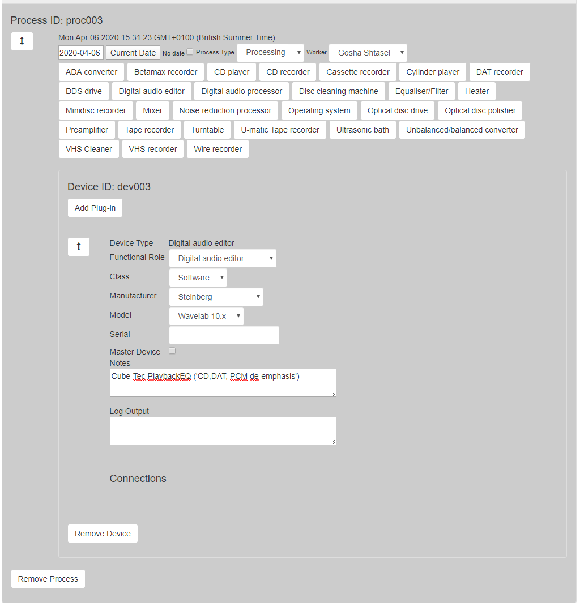  
[Back to top of the page](#top)  

## Shellac Equalization

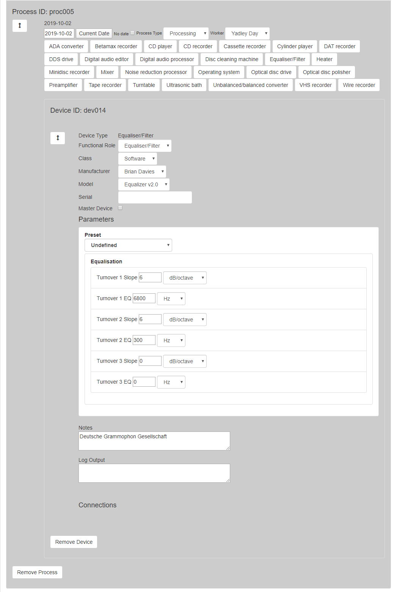  
[Back to top of the page](#top)
