

*   [Preparation & Migration](http://sip-gallery.droppages.com/#mozTocId555457)
    *   [Open Reel Baked 2 Tr (Studer→Prism)](http://sip-gallery.droppages.com/#mozTocId654654)
    *   [4 Tr (Revox→Rosetta→Prism)](http://sip-gallery.droppages.com/#mozTocId88117)
    *   [Compact cassette (Tascam→Titan)](http://sip-gallery.droppages.com/#mozTocId199816)
    *   [Shellac or Laquer disk cleaned with Ultrasonic bath and Keith Monks (Technics→Elberg→Rosetta→RME)](http://sip-gallery.droppages.com/#mozTocId98003)
    *   [Polished CD-R](http://sip-gallery.droppages.com/#mozTocId712089)
    *   [PCM VHS digital transfer (LG→Sony→Lake people→RME)](http://sip-gallery.droppages.com/#mozTocId98003)
    *   [PCM Betamax analogue transfer (Sony→Sony→Rosetta)](http://sip-gallery.droppages.com/#mozTocId475728)
    *   [DAT machine (Sony→Titan)](http://sip-gallery.droppages.com/#mozTocId439844)
    *   [DAT DDS drive](http://sip-gallery.droppages.com/#mozTocId416260)
    *   [MD digital transfer (via Sonic Stage)](http://sip-gallery.droppages.com/#mozTocId548646)
    *   [MD analogue transfer (Sony→Rosetta)](http://sip-gallery.droppages.com/#mozTocId548646)
*   [Capture](http://sip-gallery.droppages.com/#mozTocId565196)
    *   [Wavelab recording](http://sip-gallery.droppages.com/#mozTocId291967)
    *   [Reaper recording](http://sip-gallery.droppages.com/#mozTocId427035)
    *   [Sonic stage (MD capture)](http://sip-gallery.droppages.com/#mozTocId325502)
    *   [VDAT (SSD drive capture)](http://sip-gallery.droppages.com/#mozTocId723320)
    *   [dBPoweramp (CD capture)](http://sip-gallery.droppages.com/#mozTocId491581)
*   [Editing](http://sip-gallery.droppages.com/#mozTocId629496)
    *   [Wavelab general editing](http://sip-gallery.droppages.com/#mozTocId60521)
    *   [Stereo to mono](http://sip-gallery.droppages.com/#mozTocId258175)
*   [Processing](http://sip-gallery.droppages.com/#mozTocId138154)
    *   [PCM de-emphasis (for example digital VHS transfer)](http://sip-gallery.droppages.com/#mozTocId72798)
    *   [Shellac Equalization](http://sip-gallery.droppages.com/#mozTocId748782)

# Preparation & Migration  

## Open Reel Baked 2 Tr (Studer→Prism)

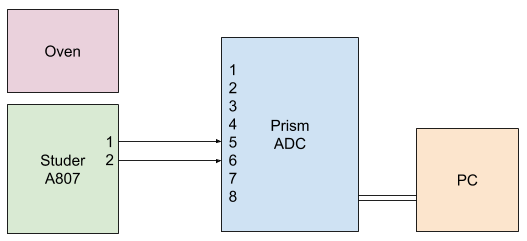
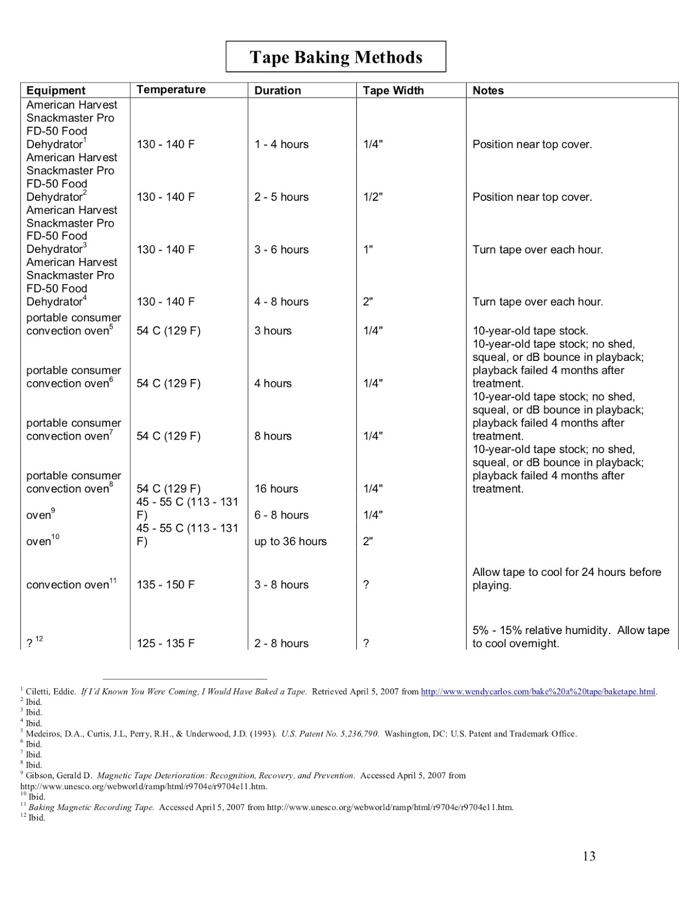
.png)  

[Back to top of the page](http://sip-gallery.droppages.com/#top)  

## 4 Tr (Revox→Rosetta→Prism)

 diagram.png)  
.png)  
[Back to top of the page](http://sip-gallery.droppages.com/index.html#top)  

## Compact cassette (Tascam→Titan)

 diagram.png)  
.png)  
[Back to top of the page](http://sip-gallery.droppages.com/index.html#top)  

## Shellac or Laquer disk cleaned with Ultrasonic bath and Keith Monks (Technics→Elberg→Rosetta→RME)

 diagram.png)  
.png)  

[Back to top of the page](http://sip-gallery.droppages.com/index.html#top)  

## Polished CD-R

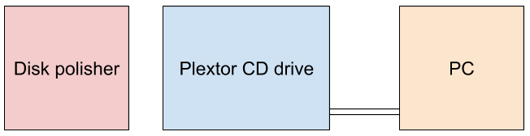  
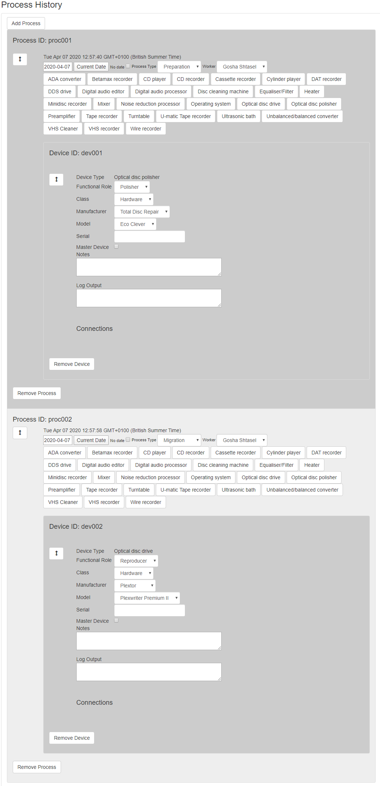  
[Back to top of the page](http://sip-gallery.droppages.com/index.html#top)  

## PCM VHS digital transfer (LG→Sony→Lake people→RME)

 diagram.png)  
.png)  
[Back to top of the page](http://sip-gallery.droppages.com/index.html#top)  

## PCM Betamax analogue transfer (Sony→Sony→Rosetta)

 diagram.png)  
.png)  
[Back to top of the page](http://sip-gallery.droppages.com/index.html#top)  

## DAT machine (Sony→Titan)

 diagram.png)  
.png)  
[Back to top of the page](http://sip-gallery.droppages.com/index.html#top)  

## DAT DDS drive

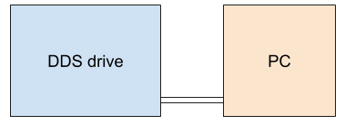  
  
[Back to top of the page](http://sip-gallery.droppages.com/index.html#top)  

## MD digital transfer (via Sonic Stage)

 diagram.png)  
.png)  
[Back to top of the page](http://sip-gallery.droppages.com/index.html#top)  

## MD analogue transfer (Sony→Rosetta)

 diagram.png)  
.png)  
[Back to top of the page](http://sip-gallery.droppages.com/index.html#top)  

# Capture

## Wavelab recording

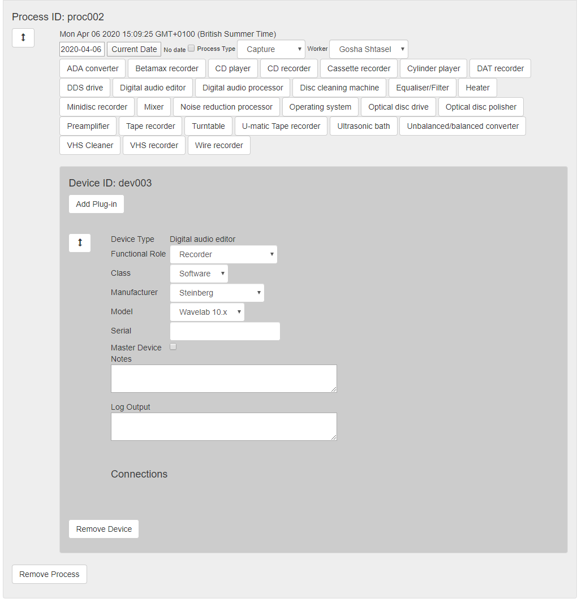  
[Back to top of the page](http://sip-gallery.droppages.com/index.html#top)  

## Reaper recording

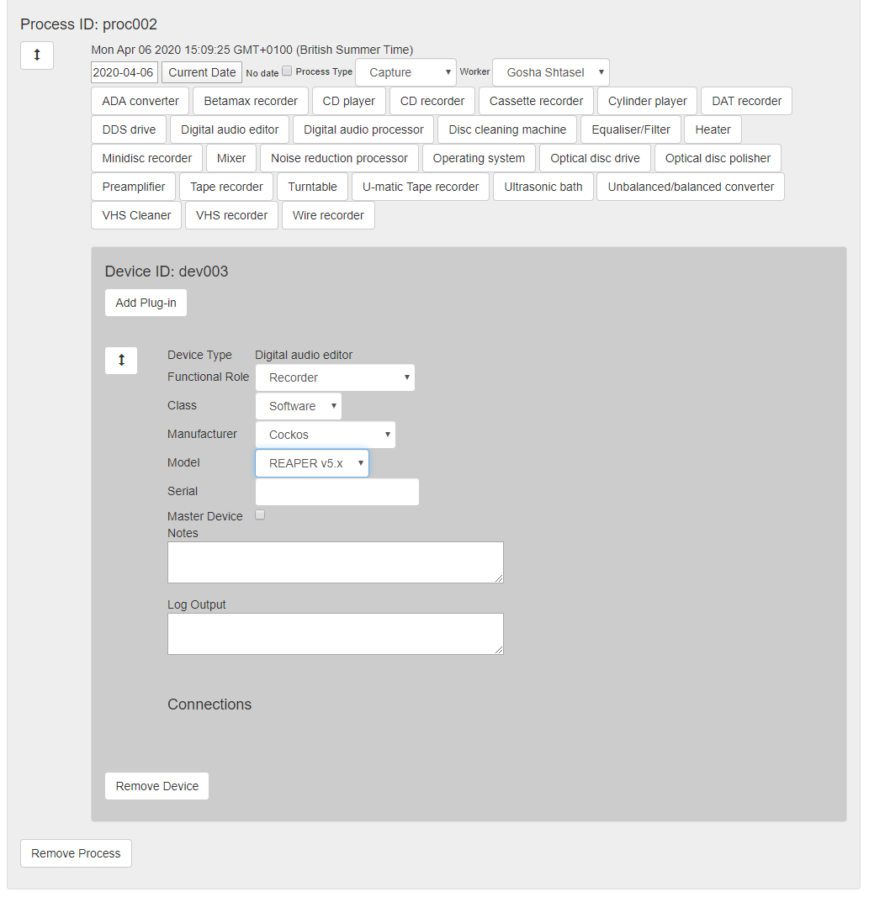  
[Back to top of the page](http://sip-gallery.droppages.com/index.html#top)  

## Sonic stage (MD capture)

  
[Back to top of the page](http://sip-gallery.droppages.com/index.html#top)  

## VDAT (SSD drive capture)

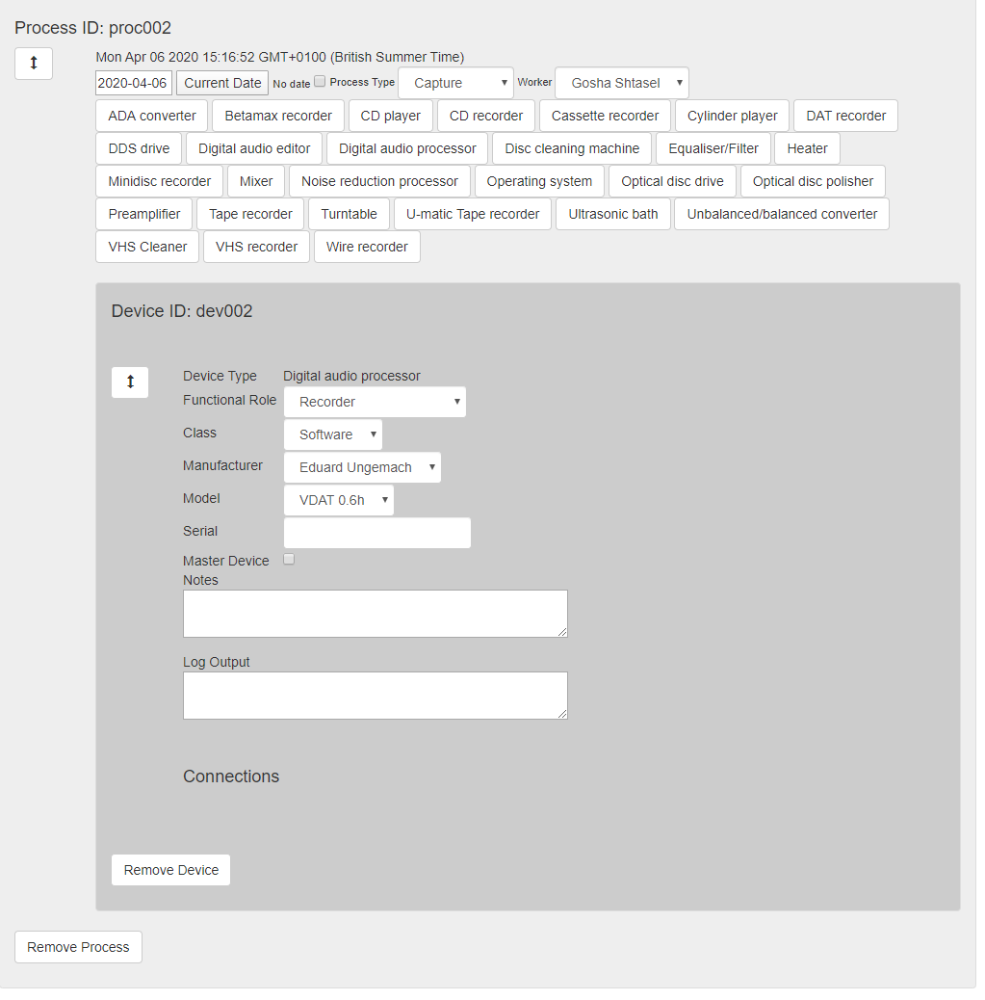  
[Back to top of the page](http://sip-gallery.droppages.com/index.html#top)  

## dBPoweramp (CD capture)

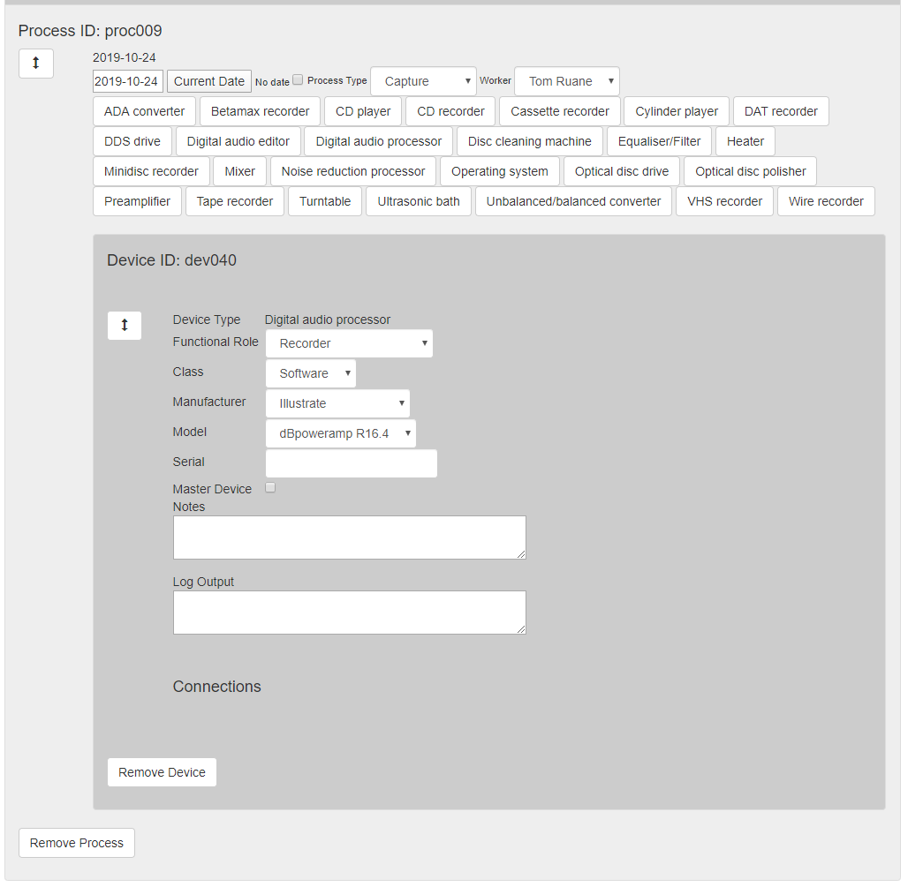  
[Back to top of the page](http://sip-gallery.droppages.com/index.html#top)  

# Editing

## Wavelab general editing

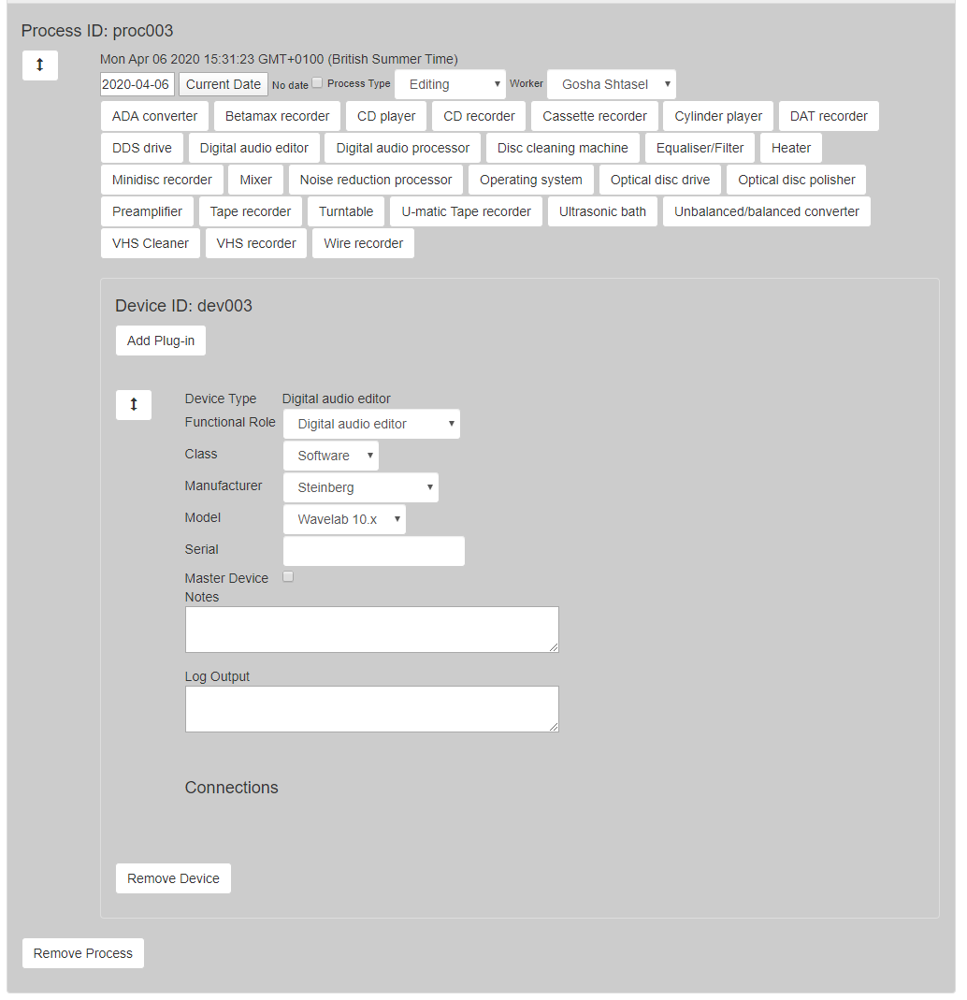  
[Back to top of the page](http://sip-gallery.droppages.com/index.html#top)  

## Stereo to mono

  
[Back to top of the page](http://sip-gallery.droppages.com/index.html#top)  

# Processing

## PCM de-emphasis (for example digital VHS transfer)

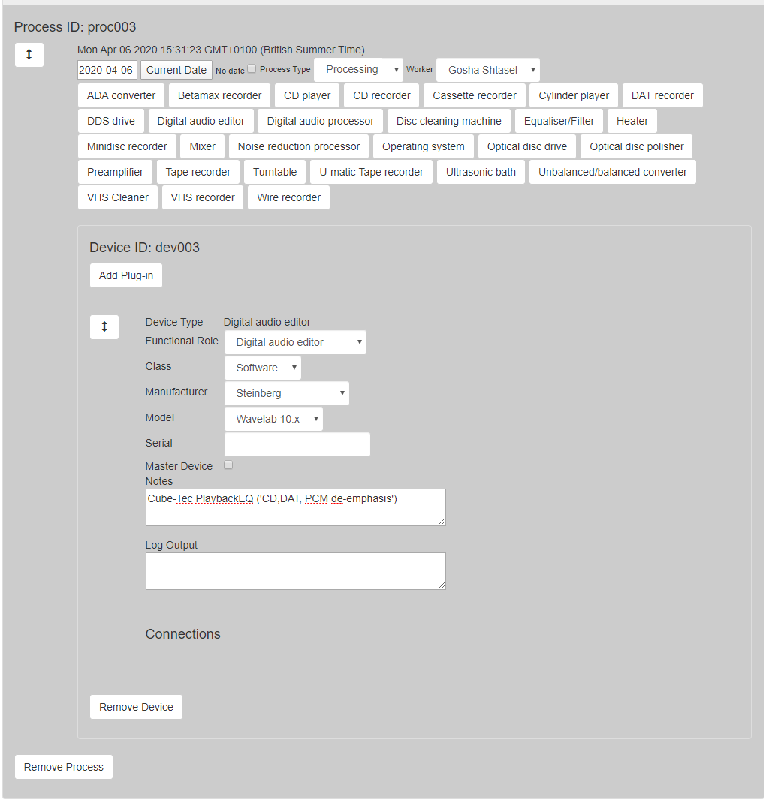  
[Back to top of the page](http://sip-gallery.droppages.com/index.html#top)  

## Shellac Equalization

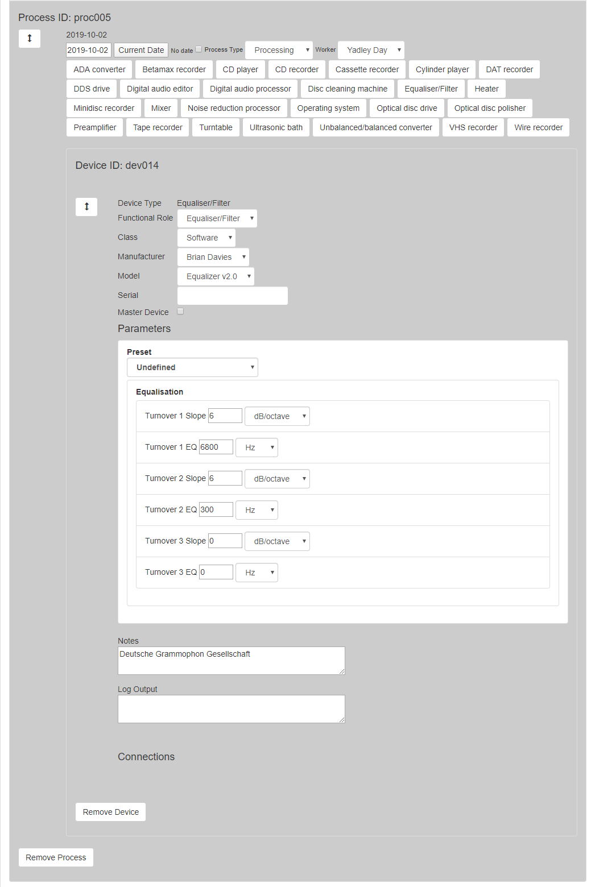  
[Back to top of the page](http://sip-gallery.droppages.com/index.html#top)
