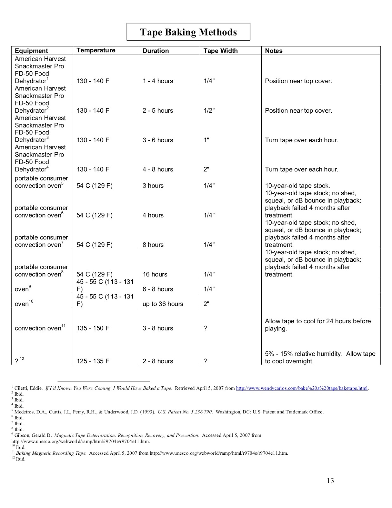

# Save our Sounds – Unlocking our Sound Heritage

### Survery of Literature regarding Tape Baking
_April 20th 2020_

Karl Jenkins

[karl.jenkins@bl.uk](https://webmail.bl.uk/owa/redir.aspx?C=TitieAObABWIfcCP-v0TKNeoRJTLVGApiItwOtdcE4qFiiAS4wbYCA..&URL=mailto%3atom.ruane%40bl.uk)

## TL;DR

-   Tapes exhibit a range of playback symptoms with a range of causes
    
-   Technology to predict some of these issues on a collection level will most likely be available soon, and low-tech methods exist now
    
-   Right now, the only way to know what’s wrong with a tape is to try and play it
    
-   Baking appears to more-or-less improve several symptoms at once
    
-   50°-55°C is a recommended temperature, 8-24hrs baking with 24hrs cooling, digitisation within a couple of weeks.
    
-   Baking is a catch-all, temporary, good enough solution where the goal is getting a complete transfer
    
-   Baking probably accelerates long term degradation, and the audio transfer is possibly not optimal
    
-   Optimal solutions may exist in future, but probably not before we run out of machines or our tapes are unrecoverable
    
-   There may exist an optimal low-humidity storage solution that can stop or even reverse binder hydrolysis, but data is scarce
    

## Summary

Degradation issues with magnetic tape present as shedding of materials including binder layer and magnetic layer, tape ‘squeal’ and ‘stick-slip’ issues on playback.

  

Several novel non-destructive methods exist to predict these issues in a given sample (with high accuracy >90%) using infrared spectrometry and others, based on analysis of chemical degradation of known compounds. Whilst these methods are not widely accessible there is a high probability that workable solutions for IR spectrometry will be developed in the near future and can be useful on a collection-level for analysing chemical degradation at the assessment stage. There are multiple studies ongoing into non-destructive analysis of vulnerable tape stock.

  

Current low-tech methods exist that are accessible to most archives including solvent extraction and pH measurement of tape stock that can provide an overview of binder decomposition in a collection by analysing known chemical by-products of binder degradation.

  

A non-destructive ‘catch-all’ solution for treatment of the individual symptoms of degraded tape does not currently exist. There appears to be a wide variability in causes of symptoms that might appear similar between tapes. This has led to studies whose aim is to ‘cure’ specific symptoms of tape degradation that can be applied to all tape stocks that have been known to cause these symptoms; these studies tend to show variable or inconclusive results which suggests that specific causes of symptoms in a given tape cannot be reliably inferred only by one variable i.e. tape manufacturer, tape model, manufacturing plant, tape age, storage conditions etc.

  

Rather, it appears that while the probability of the cause of a given symptom on a given tape can be broadly ascertained, there is no definitive treatment that can be prescribed to an individual tape that is guaranteed to have a positive effect on playback. It appears unlikely that this will ever be the case given the variables that can exist for any specific tape. While it may be possible in future to analyse individual tapes for specific chemical and physical characteristics, and from that determine an appropriate solution for an individual tape, this process does not currently exist and it is suggested in some studies that the window for digitising tape collections before they degrade to the point where they are unrecoverable is immediately. That being said, it is suggested in more than one source that a low-humidity, low temperature environment for long term storage of tapes is beneficial, and could possibly reverse depolymerisation of a tape binder layer at least where the cause of degradation is hydrolysis.

  

Where an archive needs a general method for restoring most tapes to a temporarily playable condition, baking or incubation is suggested as a generally effective method. Recommended temperatures are suggested in the range of 50-55°C for periods ranging from 4-24hrs. Where a cooling time is suggested, when baking at ambient humidity, this is no less than 24hrs. Sources also suggest that lowering the relative humidity of the baking environment can also be successful; this would support the suggestion that reverse hydrolysis of a binder layer occurs in low RH environments, and the reaction is accelerated with increased temperature.

  

Since baking a tape has been seen to be a generally effective solution for binder degradation and symptoms pertaining to lubrication in the oxide layer and friction issues on playback, it is likely that the combination of elevated temperature and lowered humidity as a by-product of heating work in combination to more-or-less treat a range of symptoms to some degree. Individual tapes exhibiting a specific symptom that can be identified may respond to other methods of treatment more or less effectively including additional lubrication, lowering tape and playback machine temperature etc., although data on these methods and their effectiveness is scarce.

  

Baking is suggested as a temporary fix to playback issues; a week to a few months is suggested as a window for digitisation. Baking is identified as a risk to further degradation; analysis has shown that in cases of binder hydrolysis, further degradation can be accelerated by heat treatment. A risk of print-through is commonly cited as a risk to baking; although there does not appear to be data that supports this, preventative measures include interleaving new tape stock to minimise the effect. It is suggested that tape that is too tightly spooled when baking is at risk of physical deformation. A study is ongoing into the effect of baking on audio transfer quality of magnetic audio tapes.

  

A broad consensus on the practice is that baking should be a method of treatment only when absolutely necessary, and is a means of restoring unplayable tapes to a generally acceptable level of playability so digitisation is made possible, the future health of the tape being of secondary concern in this scenario.

  

It is possible that a non-baking method may exist for an individual tape where individual symptoms can be treated more effectively and less destructively, and result in more optimal playback; given time and cost constraints, as well as the predicted rate of tape and equipment degradation and scarcity, long-term storage of degraded tapes in anticipation of these methods becoming available in the future is unlikely to be a recommended strategy.

## Institutional Literature

### IASA TC04

  

Describes solvent extraction and PH measurements as useful indicators of relative binder condition.

  

Offers three potential solutions to binder hydrolysis:

  

-   Room Temp, Low Humidity: 0%RH, Several Weeks. Elevated temperature increases reaction time
    

-   Successful in some cases, does not always completely reverse all the artefacts of a degraded tape
    

-   Elevated Temp, Low Humidity: 0%RH, 50°C, 8-12hrs
    

-   Unknown whether long term effects on physical characteristics of tape occur when returned to room temperature
    
-   Provides short-term effect of returning replay characteristics to original condition
    
-   Interleaving with new tape on respooling to reduce print-through may be beneficial
    
-   Recommends rewinding multiple times to reduce effect of print through due to elevated temperature
    

-   Heated Respooling: Applying warm, dry air to sticking point in tape pack and spooling at 10-50mm per minute
    

-   No further comment given
    

With reference to ‘baking’ in a laboratory oven, 
>“Exposing tapes to controlled, elevated temperatures as described above should be undertaken very carefully and only where absolutely necessary.”

  
  
  

### Stanford University Audio Preservation Manual

#### “Tape Baking”

##### Norris, S. (2007)

Provides a list of tapes that exhibit sticky shed and soft binder syndromes (Appendix A).

Provides a summary of tape baking methods from various sources (Appendix B).

Suggest best-practices based on analysis of current baking methods:

  

>“Based on analysis of the foregoing tape baking methods, the following best practice is recommended for ¼” tape:

Equipment: Fisher Scientific Isotemp Incubator 516 D

Temperature: 125 (51.6°C) – 130 F (54.4°C)

Baking Time: 4 – 8 hours

Cooling Time: 24 hours

> Should this best practice prove to be unattainable within budgetary or resource constraints, a second ­tier, acceptable practice is recommended for ¼” tape:

  

Equipment: American Harvest Snackmaster Pro FD­50 Food Dehydrator or a commercial convection oven

Temperature: 125 (51.6°C) – 130 F (54.4°C)

Baking Time: 4 – 8 hours

Cooling Time: The length of the bake – 24 hours”

  

Also suggests while ‘print-through’ is cited as a concern for tapes, documentary evidence of this is scarce.

  

### Council on Library and Information Resources

#### “Magnetic Tape Storage and Handling A Guide for Libraries and Archives”, Commission on Preservation and Access (1995)

Suggests Ampex patent as source of baking  guidelines (3 days @ 50°C). Advises that baking is only suitable for degradation through hydrolysis of the binder layer. Advises this is a temporary solution and tapes should be transferred within one to two weeks.

### Indiana University

#### FACET Format Characteristics and Preservation Problems

Suggests that binder deterioration through hydrolysis is an ongoing problem, leading to longer baking times generally. Lists a small sample of affected tapes. Lists sticky shed and unidentified soft binder syndrome problems as the two most serious risk issues in magnetic tape preservation.

## Academic Literature

### “Tape Degradation Factors and Challenges in Predicting Tape Life”

#### Hess, R (2008), ARSC Journal XXXIV, ii.

This article provides a detailed and broad overview of tape degradation and possible remedies to reported issues including binder degradation (SBS and SSS) and tapes that present with squealing and stick-slip. In terms of degradation, he shares the general viewpoints of chemists and chemical engineers in that:

  

“• Tapes are not improving with age

• There will never be a simple test kit for tape degradation classification

• The specific degradations are type- and may be batch-specific

• Tapes which are degrading now cannot be repaired and will continue to

degrade

• A tape should be transferred before degradation interferes with playback

• Anything that is important should be copied...now”

  

He refers to previous study to explain that incubation is temporarily successful because:
> “the ester end groups (both the hydroxyl and carboxyl groups) during baking displaced water on the oxide pigment surfaces and the effective Tg [glass transition temperature] and modulus of the coating went up” but is not a permanent solution because “no real repolymerization resulted.”

  

He explains the links between glass transition temperature (Tg) of binder polymers, that an increase in temperature of the binder polymer causes increased friction above a threshold temperature:

  

>“Bradshaw’s comments for SSS tape are equally applicable here. Bradshaw 1986 clearly shows the sharp increase in friction above a threshold temperature. Figure 13b of Bradshaw 1986 shows a steep rise in friction starting at 29°C, with friction doubling by 40°C, and quadrupling by 60°C. In addition to the deposit build-up, this may also explain why tapes squeal more readily when the tape and machine have warmed up.”

  

Additionally: 
>“Bradshaw has indicated that tapes with Tg below room temperature have been identified. One additional explanation of the lowering of the Tg could be the failure of the cross-linking in the polymer, as one of the benefits of cross-linking is a higher Tg. Moisture plasticizes coatings, which also lowers their Tg.”

  

He notes that: 
>“If we view this degradation as lowering the Tg then a different approach to recovering information from degraded tapes suggests itself. Efforts to date have focused on raising the Tg of the tape to make it playable, or adding lubricants in the mistaken view that the failure was loss of lubricant. Instead of the current approach, which attempts to change the physical properties of the tape, this new approach relies on accepting that the Tg has lowered. The playback environment is modified so that the tape is reproduced below its Tg.”

  

Example procedures and suggestions for modifying the playback environment by cooling machines and tapes, and for low temperature, low humidity treatment and storage of tapes with squealing and binder issues.

  

Suggestions on reducing friction during playback, cleaning tape heads and a system for lubricating tape are provided, as well as a list of lubricants and observations of their efficacy.

  

### “Recent developments in decomposition and preservation of magnetic tape”

#### Gilmour, I. and Fumic, V., National Film and Sound Archive, Canberra, Australia (1992)

Suggests solvent extraction (SE) and pH measurement as accessible means of routinely checking tapes for binder degradation without having to rely exclusively on visible indicators of decay. Describes method of SE and pH testing. 31-day test of tapes stored at 60°C and 90% RH showed accelerated aging indicated by increased tendency to shed and increased SE.

  

Undertook comparison of restoration methods:

-   Baking for 24hrs at 55°C at ambient humidity (c. 10% at 55°C)
    

-   Some tapes returned to playable condition, recovery was short lived (a few weeks or months), packaging damage and print-through observed.
    

-   One tape placed in a partially evacuated glass dessicator charged with barium oxide for 8 months at 22°C. Tape recovered from state of squealing quickly with moderate shedding to no squealing and slight shedding.
    
-   Range of tapes treated for 3 weeks at 30°C and <10%RH. Degrees of recovery noted in all tapes, from slight to dramatic recovery effect.
    

  

Notes an on-going study:

-   >“Our current program is based on a limited range of temperatures (usually around 35°C) with longer treatment times and very low RH (below 5%) regulated by means of chemical desiccant and/or thermo-mechanical (refrigerant) systems.”
    

-   >“Stable laboratory-type environmental and vacuum chambers are used to avoid pack stress or damage from fluctuating temperatures which typically occur in domestic ovens.”
    
-   >“Tapes treated in this manner show consistent improvement in key parameters.”
    
-  > “Significant recovery of tapes treated in this manner show consistent improvement in key parameters.
    

-   Suggests real-terms labor cost is not significantly greater than baking method
    

-   >”Although some forward planning is necessary to organise workflow between the lab and studios to maintain rates of subsequent dubbing, the actual labour component for batch treatment and monitoring is not great.”
    

Says higher temperatures may be used if tapes are needed ‘in a hurry’, but stops short of ‘baking’. At temperatures over 35°C interleaves tape with blank stock to minimise print through.

  

Suggests complete reversibility of decomposition may be limited by
> “migration of plasticisers, lubricants and other constituents including broken- down products of decomposition; secondary reactions, crosslinking or combinations of constituents forming different compounds to those originally present; changes in physical properties of tape over time.”

  

>“Indeed, low-humidity storage and treatment are part of a continuum of environmental conditions; having stored our tape under conditions which stabilise or even reverse hydrolysis, they can be played immediately after retrieval rather than having to wait even 24 hours for baking!”

  

### “The New ‘Non-Baking’ Cure for Sticky Shed Tapes: How Forensic Chemistry Saved the Annapolis Sounds Masters”

#### Richardson, Charles A. (2012)

The author proposes a process whereby the backing layer of a tape is removed through a chemical and mechanical process, the tape is cleaned on the backing and oxide sides. The author claims this process not only enables successful playback of tapes exhibiting SSS but also prevents further deterioration of said tapes in long term storage. Chemical analysis appears to show hydrolysis of the binder layer is a reversible reaction which can be ameliorated and even reversed through low humidity storage.

>“Cuddihy (1976) determined that the hydrolysis reactions can be reversed, if the RH is below 24% and the temperature is below 65°F. Chemists at Chemir reached the same conclusion. The process of hydrolysis happens to be a reversible reaction...subjecting magnetic tape to a low relative humidity level at ambient temperature e.g at 20% and 70°F, the hydrolysis reaction reverses.”

  

He cites Cuddihy 1976 once more in that the temporary remedy provided by baking a tape can accelerate hydrolysis and therefore speed tape ageing;

  

>“Baking tapes accelerates hydrolysis and speeds tape ageing. Neither Cuddihy nor Bertram recommend using high baking temperatures to speed up the reversal time. Ironically, the practice of baking sticky tapes as a solution only makes matters progressively worse by accelerating the chemical, physical and magnetic havoc of heat-caused SSS until the tapes are completely destroyed.”

  

The Author suggests that baking a tape is simply an expedient solution providing mediocre playback and causing permanent tape damage, and that high humidity combined with elevated temperatures can exponentially increase the rate of hydrolysis caused degradation:

  

>“heating a tape in humid conditions greatly accelerates hydrolysis activity (Cuddihy, 1980). Raising the tape’s temperature doubles the chemical activity for each ten degree increase above 70 ̊F normal temperature. Thus at 120 ̊-130 ̊F, destructive chemical activity is 64 times greater than it is at normal temperatures.”

  
  

### “Magnetic Tape “Sticky Shed” Research: Characterization, Diagnosis, and Treatment”

#### Library of Congress PRTD Study

Project for classifying magnetic tape as degraded or non degraded using non-invasive techniques like IR spectroscopy, mass spectrometry, thermal gravimetric analysis.

  

Key findings:

  

-   Quarter-inch audio tapes can be accurately classified more than 90% of the time using IR spectroscopy and PCA/LCA analysis.
    
-   All tape formats will require independent datasets for proper classification.
    
-   Infrared bands associated with polyester-urethane degradation were identified as the primary IR signals differentiating degraded and non-degraded tapes
    
-   Adipic acid, suggested as a degradation marker by others, was identified in degraded tapes using direct analysis in real time mass spectrometry (DART-MS).
    

  

### “Magnetic Tapes, Playable or Not?”

#### Cassidy, B. M and Breitung, Eric M. (2015); Perdue University, “Against The Grain” Vol. 27 Issue 4

  

Description of a project towards an accessible non-invasive classification of tapes that are playable or candidates for making using portable IR spectrometry and bespoke software for custodians.

  

>“The appealing aspects of this approach from the tape conservator’s point of view are: a) the non-invasive nature of the infrared analysis, which does not compromise sound fidelity; b) IR spectra can be obtained in less than a minute per spectrum,; and c) a decision to “bake” or “digitise” is available almost immediately.”

  

### “Documenting Sound Fidelity in Magnetic Audio Tapes Before and After Baking”

#### Library of Congress Library Services Study (Ongoing)

  

A study to research the effects on magnetic tape sound fidelity before and after the baking process. Results are currently inconclusive.

  

>“A series of extended frequency test tones were striped on fresh tape stock and then analyzed. The tapes were then baked in conditions similar to those conventionally used to reverse the effect of sticky shed syndrome and reanalyzed. This preliminary study to examine possible frequency loss produced inconclusive results. Tighter tolerances for the tape stock and record/playback equipment are required to provide the information needed.”

## Independent Sources

### Richard Hess

#### “Audio Tape Restoration Tips & Notes”

  

Comments on ‘loss-of-lubricant’ type failure modes as not documented to be actual lubricant loss. Suggest this failure mode may simply require more lubricant than originally provided to perform properly.

  

Says that baking a tape exhibiting advanced SSS is safer than playing it without baking.

  

Provides detailed notes on brands and types of tape stock that exhibit sticky shed and their various responses to baking.

### Eddie Ciletti

#### “If I Knew You Were Coming I’d Have Baked A Tape”

This article is frequently cited as a source of tape baking guidance. Recommends the American Harvest “Snackmaster Pro model FD-50”. Provides a list of suggested baking times at a temperature between 54-60°C:

  
|Tape Width	| Baking Time	|Comments
|--|--|--|
|  1/4"|1 to 4 hours  |position near top cover	|
|1/2" | 2 to 5 hours | position near top cover
|1"|3 to 6 hours|turn tape over each hour
|2"|4 to 8 hours|turn tape over each hour

Recommends additional bakings if first baking is not successful.

### Mike Rivers

#### “"Baking" Magnetic Tape To Overcome The "Sticky-Shed" Syndrome”

Suggests baking as a solution to SSS provides temporary correction and is not a permanent solution. Suggests baking at 54°C with a tolerance of ±6°C for 4-6 hours. Suggests storage with dessicant after baking to inhibit re-hydrolysis of binder layer. Notes that it is important for tape to be packed smoothly before baking.

  

Also suggests baking time range from 4 hours for ¼” tape to 8 hours for 2” tape. The Implied maximum baking time before ‘over-baking’ is ‘a day or so’.

  

## Manufacturers

### Ampex

#### United States Patent no. 5,236,790 (1993)

##### Abstract

Deteriorated or aged magnetic recording media exhibiting undesirable properties such as shed, stickiness or squeal are restored to playable condition having no such objectionable properties by heating the media to an elevated temperature and for lengths of time sufficient to restore the media. A typical temperature used is 54°C and a typical effective time is 16 hours. Ambient humidity is suitable. The restored media can be used to transfer data or information to new media. Restored media can also be again heat treated for restoration purposes, if it deteriorates again.

  
  
  
  
  

## Bibliography

  

Ampex Systems Corporation, 1993. RESTORED MAGNETIC RECORDING MEDIA AND METHOD OF PRODUCING SAME. US Patent 5236790. Available at: [https://patents.google.com/patent/US5236790A/en?oq=US5236790](https://patents.google.com/patent/US5236790A/en?oq=US5236790) [Accessed 8 April 2020]

  

Bradley, K., 2009. 5.4.3 Cleaning And Carrier Restoration | International Association Of Sound And Audiovisual Archives. [online] Iasa-web.org. Available at: <[https://www.iasa-web.org/tc04/magnetic-tapes-cleaning-and-carrier-restoration](https://www.iasa-web.org/tc04/magnetic-tapes-cleaning-and-carrier-restoration)> [Accessed 8 April 2020].

  

Breitung, E., Skelton, S., Rodriguez, J., Lu, Z., Cassidy, B., Alyea, P. and Morgan, S., 2013. Non-destructive identification of polymeric binder degradation in audio and video tapes. The Research and Technical Studies Specialty Group of the American Institute for Conservation of Historic and Artistic Works, [online] 4. Available at: <[https://www.culturalheritage.org/docs/default-source/publications/periodicals/rats-004-2013.pdf?sfvrsn=5](https://www.culturalheritage.org/docs/default-source/publications/periodicals/rats-004-2013.pdf?sfvrsn=5)> [Accessed 8 April 2020].

  

Bressan, F., Rodà, A. and Bertani, R., 2018. The Impact Of Thermal Treatment On Magnetic Tapes: An Exploratory Study Combining Chemical Analyses And Audio Features. [online] Aes.org. Available at: <[http://www.aes.org/e-lib/browse.cfm?elib=19593](http://www.aes.org/e-lib/browse.cfm?elib=19593)> [Accessed 8 April 2020].

  

Casey, M., 2007. Format Characteristics And Preservation Problems. 1st ed. Bloomington: Indiana University.

  

Casey, M., 2008. Procedures Manual. 1st ed. Bloomington: Indiana University.

  

Cassidy, B. and Breitung, E., 2015. Magnetic Tapes, Playable or Not?. Against the Grain, 27(4).

  

Ciletti, E., 2001. Analog Tape Restoration: If I Knew You Were Coming I'd Have Baked A Tape. [online] Tangible-technology.com. Available at: <[http://www.tangible-technology.com/tape/baking1.html](http://www.tangible-technology.com/tape/baking1.html)> [Accessed 8 April 2020].

  

Davis, A., Monroe, E. and France, F., 2006. Understanding Magnetic Tape Degradation By Polymeric And Material Testing. [online] Aes.org. Available at: <[http://www.aes.org/e-lib/browse.cfm?elib=19590](http://www.aes.org/e-lib/browse.cfm?elib=19590)> [Accessed 8 April 2020].

  

Fox, B., 1990. Technology: Master Tapes Come To A Sticky End. [online] New Scientist. Available at: <[https://www.newscientist.com/article/mg12717352-700-technology-master-tapes-come-to-a-sticky-end/](https://www.newscientist.com/article/mg12717352-700-technology-master-tapes-come-to-a-sticky-end/)> [Accessed 8 April 2020].

  

Gilmour, I. and Fumic, V., 1992. Recent Developments In Decomposition And Preservation Of Magnetic Tape | International Association Of Sound And Audiovisual Archives. [online]

Hess, R., 2018. Degrading Tapes – Audio Tape Restoration Tips & Notes. [online] Richardhess.com. Available at: <[http://richardhess.com/notes/formats/magnetic-media/magnetic-tapes/analog-audio/degrading-tapes/](http://richardhess.com/notes/formats/magnetic-media/magnetic-tapes/analog-audio/degrading-tapes/)> [Accessed 8 April 2020].

  

Iasa-web.org. Available at: <[https://www.iasa-web.org/magnetic-tape-decomposition](https://www.iasa-web.org/magnetic-tape-decomposition)> [Accessed 8 April 2020].

  

Lyon, M., 2020. Tape Baking And Audio Restoration, Sticky Shed Syndrome. [online] Tape-baking.com. Available at: <[http://www.tape-baking.com/](http://www.tape-baking.com/)> [Accessed 8 April 2020].

  

Norris, S., 2007. Tape Baking. [online] Sarahnorris.net. Available at: <[http://www.sarahnorris.net/Papers%20&%20Research/Tape%20Baking.pdf](http://www.sarahnorris.net/Papers%20&%20Research/Tape%20Baking.pdf)> [Accessed 8 April 2020].

  

Norris, S., 2010. Effects of Desiccation on Degraded Binder Extraction in Magnetic Audio Tape. ARSC Journal 41:2 p. 183-199

  

Richardson, C., 2003. Process For Restoring Magnetic Recording Tape Damaged By “Sticky Shed” Syndrome. US Patent 6797072B1. Available at: [https://patents.google.com/patent/US6797072B1/en](https://patents.google.com/patent/US6797072B1/en) [Accessed 17 April 2020]

  

Richardson, C., 2006. Solving the Sticky Shed Problem in Magnetic Recording Tapes: New Laboratory Research and Analysis Provides a Safe and Effective Remedy. Audio Engineering Society Convention Paper, [online] Available at: <[https://secure.aes.org/forum/pubs/conventions/?elib=13803](https://secure.aes.org/forum/pubs/conventions/?elib=13803)> [Accessed 8 April 2020].

  

Rivers, M., 2020. Audio-Restoration By Graham Newton - "Baking" Magnetic Tape To Overcome The "Sticky-Shed" Problem.. [online] Audio-restoration.com. Available at: <[http://audio-restoration.com/baking.php](http://audio-restoration.com/baking.php)> [Accessed 8 April 2020].

  

Van Bogart, J., 1995. Magnetic Tape Storage and Handling A Guide for Libraries and Archives. [online] Clir.org. Available at: <[https://www.clir.org/wp-content/uploads/sites/6/pub54.pdf](https://www.clir.org/wp-content/uploads/sites/6/pub54.pdf)> [Accessed 8 April 2020].

  
  
  
  
  
  

  

## Appendix A: List of Tapes exhibiting sticky shed syndrome and soft binder syndrome

  

#### Norris, S. (2013)
### Sticky Shed
|Brand|Type|Years
  |--|--|--|
  |AGFA|PEM 468|Pre-1990
  ||PEM 469|Pre-1990
  ||Type 1 (cassette duplicator)|unknown
  |Ampex/Quantegy|406|1970s-at least mid 1980s
||407|1970s-at least mid 1980s
||456|1970s-at least mid 1980s
||457|1970s-at least mid 1980s
|Audiotape/Capitol|Q15|Early 1980s
|Scotch/3M|153|unknown
||206|unknown
||207|unknown
||208|unknown
||209|unknown
||217|unknown
||219|unknown
||226|all years
||227|all years
||806|all years
||807|all years
||808|all years
||809|all years
||Classic DP|unknown
||Classic LP|unknown
||Classic SP|unknown
||Master|unknown
||Master SX|unknown

### Soft Binder

  
|Brand|Type|Years
  |--|--|--|
|Scotch/3M|175|unknown
||Melody 169|unknown
|Sony|PR-150|unknown
|Pyral|unknown|unknown

## Appendix B: List of various tape baking methods

#### Norris, S. (2013)

