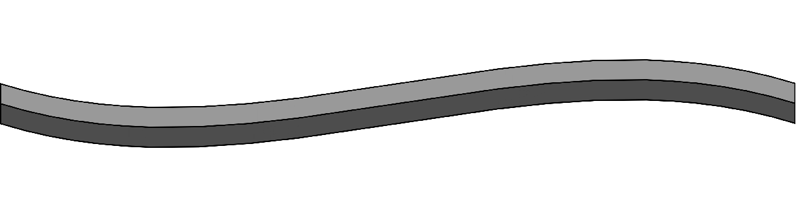
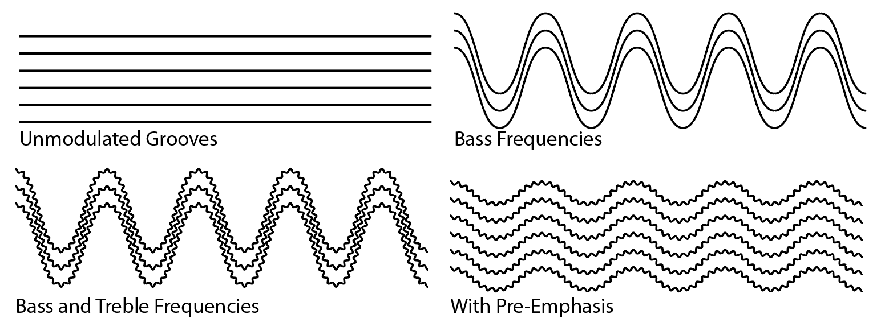
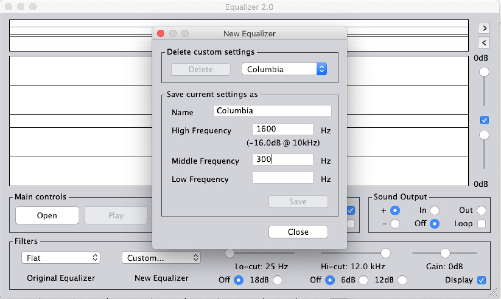

# Save our Sounds – Unlocking our Sound Heritage

### Shellac Discs
_April 20th 2020_

Karl Jenkins

[karl.jenkins@bl.uk](https://webmail.bl.uk/owa/redir.aspx?C=TitieAObABWIfcCP-v0TKNeoRJTLVGApiItwOtdcE4qFiiAS4wbYCA..&URL=mailto%3atom.ruane%40bl.uk)

## Overview

  

A ‘shellac’ disc is a type of phonograph record. They are similar in shape and size to more modern vinyl records, and are played in a very similar way.

  

These discs are often called gramophone records, since they were made to be played using a gramophone, or ‘78s’, since the most common playing speed of these discs is 78rpm.

  

They’re also called shellacs, which refers to the one of the materials, shellac, used in the manufacture of the discs. Shellac is a resin type material that is excreted by the ‘Lac’ insect on trees in India and Thailand.

  

Discs would be made from a combination of shellac1 and other materials including clay, rock dust, fabric and charcoal  ,and combined to create a mixture that could be melted into putty.

  

It’s worth mentioning that not all gramophone records are made from shellac, some are made from early plastic-type material, but these can be treated in the same way. We’ll refer to these discs as shellac discs for simplicity, since they are the most common type of disc you’ll come across.

  

You can find a helpful guide to identifying what kind of discs you have in your collection here: [Link to identifying formats]

  

Shellac discs are mass-produced copies of an original ‘master’ disc, either a solid wax disc, or from the mid 1930s, a lacquer disc.. A groove is cut into a lacquer disc using a cutting lathe, which makes a spiral from the outside to the inside of the disc. Sometimes the spiral is cut from the inside to the outside, but this is relatively rare.2

  

A metal stamper is made from this original master disc, which is then used to stamp out duplicates into discs made from durable materials. This format overtook phonograph cylinders to become the most popular format for listening to music and speech in homes and over the radio across the world. These discs often had a longer recording time than cylinders, and were cheaper to make, easier to store and easier to ship than cylinders.

  

Shellac discs were made from the 1890s until they were eventually superseded by vinyl records completely by the 1960s. Since they were popular over a long period, and are made from very durable material, examples of shellac discs are relatively common.
>1 Charcoal derived from wood and sometimes bones

>2 Lacquer ‘master’ discs are made from softer material like cellulose or gelatine with an inner-core of usually metal or glass and are one sided. Usually the label is hand-written, but not always. You can check to see if your disc is a lacquer by inspecting the spindle hole in the centre of the record to see if it’s layered. Gently tapping the disc will make a metallic or glassy sound, in which case it’s probably a lacquer. Lacquer discs need to be treated differently than shellac discs, and more information can be found here: [Link to Lacquer Discs].
## Identification

  

A guide to identifying what kind of discs you have in your collection can be found here: [Link to identifying formats], but we’ll briefly re-iterate the key points.

  

Shellac discs are circular discs, usually 10 inches (25cm) or 12 inches (30cm) in diameter3. They have a ‘spindle hole’ in the middle of the discs where they can be placed onto a turntable for playing, usually around 7mm wide.

  

The disc may have grooves on one, or both sides of the disc. Single-sided discs are usually those made before 1910. Generally, the grooves of a shellac are wide enough to be seen individually by the naked eye, where a ‘microgroove’ vinyl record requires a microscope.

  

Commercially released discs will have a label stamped into the middle of the disc, which might provide information about the record label, artist and playing speed.

  

There may also be a collection of letters, numbers or shapes stamped into the disc, near the label, this can include a matrix number, which can provide other useful manufacturing information, covered later. Other letters and numbers on a disc can denote catalog and issue numbers, side numbers or other information depending on label and era.

  

When compared with modern vinyl records, they are:

  

-   Rigid i.e. they will not bend
    
-   Brittle i.e. the disc is more likely to break than bend
    
-   Thicker and heavier
    

  

The earliest (pre-1900) gramophone records were pressed with ‘gutta-percha’, a latex-like natural compound derived from the sap of a tropical tree, or hard rubber. These discs, along with later examples of early-plastic discs (some as late as the 1940s in some markets) have a waxy texture, and are slightly less rigid than shellac, but not much, and will still smash if dropped.

  >3 Shellacs can be up to 21” and as small as 5” and anything in-between.

## Risk

Shellac discs in good condition i.e. not cracked, and in one piece, can be considered low risk of degradation, since the manufacturing materials are stable and robust, and when stored and handled appropriately will not significantly degrade over many decades. They are at low risk of obsolescence given their mechanically uncomplicated method of operation.

  

At slightly higher risk are those discs which are broken into more than one piece, since the chances of those pieces deforming in shape or being lost or damaged further due to handling, increases over time. Cracked discs share this potential for further damage. That being said, if damaged discs are stored appropriately, and not handled unnecessarily, then the risk of further damage to the disc itself is mitigated. Cracked and broken discs present degradation of the signal transfer through loss of groove information and can potentially damage playback styluses.

  

Discs made from shellac and early plastics will shatter when struck or dropped, so the highest risk to these items is from handling when inspecting, cleaning or playing back.

  

## Degradation

  

The shellac material in coarsegroove discs will eventually become more brittle over long periods, shedding a fine powder when replayed, although this effect is rare with a good storage environment. High humidity can accelerate this process.4

  

Since the manufacturing materials in shellac discs can vary, organic materials in these discs may be susceptible to fungus, although in undamaged discs where the core material is not exposed the risk of this is low.

  

Deformation, bending and warping of discs can occur slowly, over long periods if stored inappropriately i.e. stacked, or horizontally, and in high temperature environments. In the right environment, stored correctly, this risk is low.

  

Where a disc is broken, pieces can deform so that they bend or change shape slightly, making it more difficult to fit them back together for playback. Broken pieces will do this over time, regardless of storage conditions, although this action is slow, and mainly an inconvenience rather than a catastrophic change.

  

That being said, piecing together a broken disc for digitisation should be a priority for discs that are recently broken, minimising not only the risk of broken pieces changing shape, but lessening the chances that pieces are lost or damaged further over time. Where an unbroken copy is accessible, in most all cases it will produce better and quicker results to transfer this rather than the broken disc.

  

Exposure to ultraviolet light can change the colour of shellac discs over time and damage a variety of compounds in shellac formulations, leading to material softening and deformation of grooves and disc, so leaving them out of their sleeves in direct sunlight is not recommended!
>4 St-Laurent, G., 1996, “The Care and Handling of Recorded Sound Materials”
## Obsolescence

  

Even though shellacs stopped being manufactured around 1960, and some can be over 100 years old, they are played in very much the same way as modern vinyl records, with a few simple adjustments to modern equipment.

  

New turntables that will play at 78rpm are generally easy to come by, and tend to be no more expensive than other turntables of similar quality.

  

The stylus or ‘needle’ of the record player needed to play back shellac records is typically around four times bigger (at the tip) than one used for vinyl records, which is what is usually provided with new turntables.

  

There are a few large suppliers, like Ortofon, Shure and Grado that sell an all-purpose 78 stylus, which will suffice as a general choice for most records in a domestic setting, but an archive should have a set of styluses in a range of sizes and shapes that can be obtained from specialist suppliers. These tend to be smaller artisan manufacturers and their existence is largely dependent on demand for this equipment. There is a risk that if the enthusiast or archival market shrinks in future that this equipment may be more difficult to come by or increasingly expensive.

  

Since shellacs are durable when stored correctly, and the equipment needed to play them back is still being manufactured, this format is at low risk of becoming obsolete in the near future.5
>5 The corner of a polymer £5 note, introduced in 2016 in the UK, can be used as a rudimentary means of picking up and amplifying sound from a grooved disc. This is not recommended practice for archival use but shows that so long as we can rotate a disc and make something vibrate in its groove, then the format won’t be obsolete for a long time.
## Storage / Care and Handling

  

At the very least, discs should be kept in a cool, dry environment, ideally ventilated to discourage fungus, mold and other biological catastrophes.6

  

The ideal environment for long term storage of discs is a temperature of 15-20°C, with a maximum fluctuation of 2°C over 24hrs. Relative humidity should be 25-45%, with a maximum fluctuation of 5% over 24 hrs.

  

Discs should be stored vertically, ideally in an acid-free archival cardboard sleeve appropriate to the size of the disc, or in a protective sleeve of any kind at the very least.7 This minimises the risk of warping of the disc over time, and protects the playing surface from dents and scratches.

  

When storing a lot of discs, separate batches of discs with vertical dividers, like bookends, to reduce the risk of sideways pressure on any individual disc, which can break discs over time.

  

Discs should be handled using the edges and/or centre to eliminate contact with the playing surface.

  

When handling discs, take care to avoid drops onto hard surfaces. Shellac and early-plastic discs will shatter when dropped,8 and so should be handled over a table or desk to minimise this risk. Shellac discs in particular can be very smooth around the edges, so care must be taken to hold the disc around its edges with an even pressure to the centre of the disc whilst avoiding touching the playing surface.
>6 Shellac itself is considered to be resistant to fungus, but since there’s a combination of who-knows-what in a given formulation, including organic material, it’s better to be safe.

>7 ‘Acid-Free’ is regarded as a better choice for archival use in general, although whether or not it’s beneficial to shellac discs is unclear.

>8 Sometimes into two pieces. Sometimes into many, many more. Be careful!
## Technical Principle of Operation

  

A shellac disc works by vibrating the tip of a stylus placed into its groove while it’s rotating. The spiral shape of the groove will move the tonearm of a record player from the start of a record to end. At the end of the record, an infinite loop is usually cut so that the tonearm will remain in place, until it’s picked up from the disc. This is called a locked groove.

  

The vibrating stylus sends an electrical signal to a pre-amplifier or ‘preamp’, using magnets. This signal is played from the preamp, through speakers, as sound.

  

For a more in-depth look at how grooves work, see Appendix A: Grooves.

  

The sound that comes from the disc, without any extra processing, is known as flat. We need to apply some extra processing to that sound so that we can hear the record as it was intended.

  

When making a recording for a shellac, an engineer would remove bass frequencies and sometimes amplify treble frequencies so that the recording would transfer to a disc correctly. We can refer to it simply as EQ, which stands for ‘equalisation’.

  

Since 1954, virtually all engineers have used the same EQ for vinyl records, known as RIAA EQ. This means that if you play back a vinyl record using a preamp with RIAA EQ (which is in-built into most modern hi-fi equipment), the record will sound correct, with the right amount of treble and bass.

  

Shellac discs, over their 80 year lifetime were made with many different kinds of EQ! This means if we play a shellac disc using RIAA EQ, it won’t sound optimal.

  

Thankfully, we can do one of two things to play back shellac records with the right EQ. Either we can use a preamp which allows us to select different EQ curves, or we can digitise the ‘flat’ signal first, then use software to apply an EQ curve afterwards.

  

Discs recorded before 1925 are ‘acoustical’ recordings, and don’t need an EQ, since they were recorded ‘flat’, they can be digitised as such.

  

In summary, whilst you could put a shellac gramophone record on a modern turntable and play it through a Hi-Fi, it would sound pretty bad, since the stylus would be too small, and the EQ would be incorrect, possibly rotating at the wrong speed entirely.

  

For a more in-depth look at how EQ works, see Appendix B: EQ.

## Format Issues

  

### Physical Issues

  

#### Dirt

Because shellac discs are covered with grooves, this is an ideal place for dust, dirt and grime to get trapped. It’s difficult to see or know how much dirt might be in the grooves of a disc without comparing it with a cleaned version, so generally we assume that unless a disc has been recently cleaned, then there’s probably dirt in the grooves that we should remove.

  

A dirty disc will generally sound noisier than a cleaned one, with less high frequency reproduction in the audio material, increased high frequency noise, and more ‘popping’ and ‘clicking’ on playback. Dirt and debris will also collect on the stylus of your turntable while playing, which isn’t great for your equipment, and can even make a big difference in sound quality between the start and the end of a dirty record. As your stylus scrapes along the groove of a dirty disc, it drags with it all of the debris it collects on the way, which can clump together, and make your needle skip out of the groove.

  

Since the groove walls of a shellac disc are deliberately abrasive9 and more coarse than a modern vinyl record, these discs will always sound noisier than their modern counterparts anyway, so reducing unnecessary extra noise from dirt is important to get the best sound from our discs.

  

There are various methods and equipment you can use to clean shellac discs which are covered in Equipment and How to digitise a shellac disc.

  >9 Originally, gramophone records were played back using a soft steel stylus that would be ‘ground’ by coarse groove walls, conforming the stylus to the shape of the groove.

#### Broken Discs

The clearest indication that a shellac disc is damaged is if it is in more than one piece. In the best-case scenario a second unbroken copy can be found; in the second-best-case scenario it can be possible to place the pieces of a disc on a turntable and fit them together like a jigsaw.

  

The size of the grooves on a shellac disc mean that fitting broken pieces together and holding them in place can be possible. With clean breaks where the grooves are undamaged, this can be relatively simple, yielding good playback results with a click in the audio where the break boundary lies.

  

It is common, however, for the pieces of a broken disc to change shape slightly over time, meaning pieces become slightly larger or bow, meaning they don’t fit flush to other pieces of the disc. Pieces can be held in place on the turntable, around the edges of the disc, using a putty-like pressure-sensitive adhesive10. Take care to avoid the grooves of the disc using this method, using as little as possible. You can apply a fair amount of inwards pressure when fitting large pieces back together, depending on the general condition of the disc, but avoid scraping motions between the broken edges. Where a piece doesn’t lie flush with the disc, you can alter the height of a piece by placing something underneath a broken piece of disc. Multiple layers of a material no thicker than a sheet of paper are useful in making small changes to the height of a broken piece. Where it is impossible to make the pieces flush, err on the side of making a section of disc that plays first the higher piece. This means that during playback your stylus will drop into the groove of the next section rather than come up against a wall which might damage your stylus or your disc.

  

Where there are more than, say, two or three pieces, it might be beneficial to begin with a low-adhesive, non-residue tape on the reverse side of the disc to begin with, making smaller adjustments to the playback side.

  

Your mileage, of course, may vary depending on the condition of your collection, and it must be said that when working with a broken disc, the optimal solution is one that requires the least amount of interference with the broken pieces and the grooves on either side. If a disc is broken, your aim will be to be able to play back the disc from beginning to end, and nothing more. You will hear ‘pops’ during playback at the boundary of each crack; this is to be expected, and while repositioning pieces in small ways might reduce this somewhat, this should be of secondary concern to a complete playback.

>10 Available in a variety of colours, including blue.
#### Surface Loss

  

Occasionally you may find that the angle of a particular crack11, or missing groove material on a disc means that your stylus will skip to the next groove, or stay in the same groove, repeating. It is up to you whether you play a disc up until the point of damage, and record another file of playback after the damage, or allow the disc to play entirely including any skips. Some chips or pitting might be insignificant on a disc spinning at 78rpm, but larger surface damage may be impossible for your stylus to navigate. The only way to know for sure is to play the disc and see what happens.

  >11 Concentric cracks i.e. cracks that follow the groove are particularly troublesome.

#### Warped Discs

  

Despite its rigidity, shellac discs can warp. Usually, this happens over a long period of time, in less than optimal storage conditions. Sometimes the entire disc can become concave, or one edge can be bowed; it might play correctly, but doesn’t lie particularly flat on your turntable. You can add a centre-weight to your turntable (see: Equipment) to minimise lateral movement of a disk and can be helpful to centre a disc correctly where the spindle hole is over-size. There is a risk where a disc is not entirely flat that additional centre weight can cause damage to the disk, so be careful when adding a centre weight to not apply undue pressure to a disk.

  

A more subtle warping can occur where the disc is mostly flat, save for ridges or creases in the disc. This can be heard on playback as audio drop-outs, where the stylus is being trampolined out of the groove and back into it as the disc spins. Playing a disc back at half-speed12 (i.e. 39rpm) can solve this problem a lot of the time. Sometimes increasing the weight of the tonearm can also help.

  

Attempting to flatten a warped, bowed or creased disc is not recommended; there are very few examples of successful heating or flattening of shellac discs (see: Broken Discs).

  >12 The digitised audio is then played back at double speed.

### Equipment Issues

  

#### Speed

  

Most shellac discs are recorded at somewhere around 78rpm. Some discs will have ‘78rpm’ printed on their label, a range of speeds suggested on their sleeve (if available), or no guidance whatsoever. A turntable that spins at 78rpm with a wide adjustable speed control is a recommended option.

  

Pre-1925 ‘acoustically recorded’ discs, also called acoustics, may not be. Early disc speeds can vary between 60-130rpm, but by 1910 speeds between 76-80rpm were the norm, 78rpm being a suggested standard from 192513, although there still exists some variability in discs after this date.

  

Ideally, the playback speed of a disc will be printed on the centre label, or on the discs original sleeve. Sometimes a range is given i.e. ‘Between 90-100rpm’. In the absence of either, it will take a keen ear and knowledge of the content to discern an appropriate playback speed. A turntable with a wide speed control (often labeled as pitch control) is most useful for this, and models can be had that can vary the speed ±50%, sometimes more. This will be unnecessary if the discs in your collection are all labeled as 78rpm. In any event, it is crucial that the speed chosen be accurately documented in accompanying metadata. Where a non-standard decision has been made, it is worth also documenting the reason.

  >13 78.26rpm to be more precise

#### Stylus

  

Stylus sizes are described as measured in ‘mils’14, with a ‘conical’ or ‘elliptical’ shape.

  

A general purpose ‘78’ stylus fitted to your turntable will play back most discs successfully. These are generally 3.0 or 2.5 ‘mils’, with a ‘conical’ tip. When shopping for styluses on more specialist websites, this might be described as simply ‘a 3.0 mil conical’.

  

The nitty-gritty on stylus shape and size can be found in Appendix C: Styluses, but for now know that the best size of stylus for any given disc can be between 4.0 and 2.0 mil. This is because before 1954, the size of a records groove wasn’t standard, and different record labels used different ‘groove widths’ over the years. Having a range of sizes means we can check to see which size gives us the best playback for a given disc. Styluses of different width will contact the same pair of groove walls at different heights. This can be helpful in avoiding areas of the groove wall which have become worn in certain places.

  

These different stylus sizes are often presented in two flavours; conical or elliptical.

  

Conical styluses make less contact with the groove walls, meaning that on a very worn disc (or an early acoustic disc), playback can be clearer and with less noise. This comes at the price of reduced treble frequencies in the audio material. Elliptical styluses have a geometry that makes less contact with the groove wall and tracks the groove modulation more accurately, allowing more faithful capturing of a wider range of frequencies, and on a post-1925 disc in good condition these are the preferred choice.

In an ideal scenario you would have access to a set of conical and elliptical styluses in sizes 2.0, 2.3, 2.5, 3.0, 3.2, 3.5, 4.0, so fourteen in all. For digitising a handful of discs this might well be overkill, so we’ll make some general recommendations later in Equipment.

  >14 Where one ‘mil’ is one thousandth of an inch, and the number is the radius of the tip in mils.

#### EQ

  

We briefly mentioned choosing the right EQ for playing back a shellac record in Basic Principles of Operation. There are hardware and software products that come with a range of common EQ presets that will work for most of the major record labels you might come across, like HMV and Columbia.

  

Using a hardware preamp with these choices means simply choosing the right setting and playing the disc. Using a software solution means taking your ‘flat’ audio file, opening it in the software and selecting the right option to process the file.

  

There are vast tables available online that can show you which EQ preset to use for which record label, in which year, with which colour label etc. (see Appendix D: Useful Resources). These are usually given a name which corresponds to the preset on your hardware or software. Names like HMV, Blumlein and Decca are common.

  

It is helpful also to refer to those stamped numbers, letters and symbols on your shellac disc. Sometimes a triangle or a square shape pressed onto a disc means you should use a particular EQ for that disc.

  

Where the waters muddy a little is if your collection is from a less well-known record label, or your label is not American, British or European. The majority of well-documented research into old EQ curves has been into the largest record companies from Europe, the UK and America.

  

It can be difficult to find simple answers to the EQ question if your discs are from Middle-Eastern or African record companies15, for example. In this case, make a cup of tea, dim the lights and refer to Appendix E: Dial B for Blumlein for a helpful guide and anecdotes.

  

It’s worth mentioning that ‘choosing the wrong EQ’ isn’t the end of the world or your reputation. When we describe the digitisation process later, you’ll see that making a flat transfer of the audio, and applying the EQ afterwards means that we aren’t making destructive choices when digitising our discs. Even audio recorded through a hardware preamp with the ‘wrong’ EQ can be re-processed. It’s not ideal but it is possible.

  

Besides, the audible difference between a lot of EQ curves can be negligible16, but at the very least it pays to know why we’re making a particular choice and how we came to choose it so we can keep a record of our process.

>15 Or Russian, Brazilian, Thai, Indian...

>16 To the casual listener...

## Approaches

  

### Stylus-based Playback

  

As of 2020, the most accessible and cost-effective means of digitising shellac discs is through traditional playback, on a turntable, with a stylus. Equipment is widely available, easily maintained and simple enough to operate.

  

Generally, shellac discs are durable and were designed to be played using a tracking weight much heavier than that required from modern turntables. This means that with a disc in good condition, the chances of wear or damage to the grooves of a shellac disc during replay using modern equipment is relatively low.

  

The limitations of this approach are the difficulty in playing discs that are badly deformed, damaged or broken so as to make playback impossible. Missing pieces or large areas of surface loss can make an entire disc unplayable using traditional methods, and so other techniques are being developed to capture the sound on a disc without relying on tracking the grooves with a stylus.

  

### Optical Methods

  

Research into new methods of scanning a disc, and extracting the audio information from it is ongoing. An example of this is the **IRENE**17 project from Berkeley Labs at the University of California, currently being evaluated at the Library of Congress.

  

Their method involves photographing the grooves of a disc and converting the shape of the groove into audio data. Their software allows warped or broken discs to be digitally reconstituted after scanning, with impressive results.

  

Other methods under research involve using laser triangulation to measure the shape of the grooves, converting the data into an audio signal.18

  

While these methods can yield impressive results, and could at some point become a superior way to digitise shellac discs, they are at this point largely inaccessible to most users. It’s still worth considering as an option in future, though, if your collection comprises many rare and valuable, but heavily damaged examples.

>17 The IRENE project at UC Berkeley Labs [http://irene.lbl.gov/](http://irene.lbl.gov/)

>18 [PDF] A Laser Triangulation approach for Optical Audio Reconstruction of Phonograph Records [https://liu.diva-portal.org/smash/get/diva2:1056370/FULLTEXT01.pdf](https://liu.diva-portal.org/smash/get/diva2:1056370/FULLTEXT01.pdf)
## Equipment

  

For digitising shellac discs, you will need:

  

1.  A turntable with
    
2.  A headshell, cartridge and stylus(es)
    
3.  A phono preamp
    

-   [Option A:  With selectable EQ]
    

4.  A computer with an audio interface, or sound card
    
5.  Software to record the audio file
    

-   [Option B: Software to process the EQ]
    

  

Good things to also have for digitisation include:

  

-   Heavy rubber mat for your turntable
    
-   Turntable centre weight
    
-   Stylus ‘force-gauge’ for measuring tracking weight
    

  

For cleaning shellac discs, you can use:

  

-   A soft-bristled record brush
    
-   A wet/dry cleaning machine
    
-   An ultrasonic bath
    

  

Good things to have for cleaning include:

  

-   Lint-free cloths
    
-   Demineralized water
    
-   A surfactant, like Ilfotol or Photo Flo
    

  

A list of suppliers is provided in Appendix F: Equipment Suppliers

  

### Turntable

  

Choosing a turntable in 2020 can be somewhat daunting, since the market for new turntables is rather large, and the range of features and prices on offer is broad. There are good deals to be had on second-hand or reconditioned turntables, but if you choose to go down this route, make sure that there is a local repair technician who you can contact if you have a problem. Turntables are relatively simple machines, and with a bit of know-how it can be worthwhile to learn how to keep them in good condition yourself.

  

Essential features of the turntable:

-   Plays at 78rpm
    
-   Has a removable headshell or replaceable stylus
    
-   Is large enough to play your largest shellac discs19
    

  

Desirable features of the turntable20:

-   Plays at 33rpm and 78rpm with a speed adjuster of ±50%21 or more, or can be modified to include these options
    
-   Speed accuracy is ±0.1%
    
-   Wow and flutter is better than 0.01%
    
-   ‘Unweighted Rumble’ is less than 50dB
    

  

Extravagant features of the turntable22:

-   Has multiple tonearms to speed up workflow
    
-   Matches the decor of your work environment for harmonious digitisation
    

  

It’s difficult to recommend specific turntables since the market is so large, but new and used options from Technics have a good reputation for reliability, performance and availability of spare parts. Modifications for these turntables are also popular for adding desirable features such as a wide pitch control, upgraded power supplies and platters etc. Professional companies such as ‘KAB’ and ‘SoundHifi.com’ provide modification services and can supply ready-modified units to your specification.

Example: A Technics SL-1200 modified to play at 78rpm can be had for around £800. Unmodified, second-hand units can be purchased for around £400, but might require refurbishment.

  

Additionally, you should furnish your turntable with a heavy turntable mat which makes good contact with the disc. Heavy rubber mats help to reduce vibrations from the turntable and its surroundings. There is no limit to the amount of vibration isolation you can apply to the desk or table on which you place your turntable, including heavy marble slabs, sound isolating mats and the like, but at the very least a heavy mat should be an essential purchase.

  

A centre weight that you can place on your disc is also a good purchase. This will hold discs in place that have oddly shaped centre holes, and minimise lateral movement around the record centre. Beware of concave-shaped discs, though, and take care when adding any weight to a shellac disc.

  

A stylus ‘force-gauge’ enables you to measure how much tracking weight you’re applying to a disc. A target of 3.0g is a good starting point. When changing styluses, for example, it’s useful to know how the weight varies between each stylus, and what setting to use on your turntable to reach your target tracking weight.

>19 If your collection contains discs larger than 12”, finding a turntable will be more difficult, but not impossible, and it’s likely you will require a second-hand machine.

>20 You’ll find these on spec-sheets, or a list of detailed specifications for a turntable

>21 This is sometimes called ultrapitch or varispeed.

>22 Can be essential, depending on who you’re speaking to...
### Headshell and Styluses

  

At the end of the tonearm of a turntable is a headshell, to which a cartridge and stylus is attached. The stylus, via the cartridge, converts mechanical motion on the record into an electrical signal. 

Many new turntables come with tonearms that do not have an entirely removable headshell, but the cartridge and stylus can be removed. On some cheaper turntables, only the stylus may be removed.

  

A turntable with a removable headshell is the recommended option, and makes finding the best stylus size for a disc much easier, without having to frequently swap fiddly styluses. This does of course mean you’ll need separate headshells, each with its own cartridge and a stylus, and so this option tends to be more expensive than buying just one, or a set, of styluses to use with one headshell/cartridge.

  

A stereo cartridge is the recommended choice, which will be explained in Outputs.

  

A ‘general’ 78rpm stylus made by Ortofon, Shure, Audio Technica etc. will be sold as compatible with certain cartridges by those manufacturers. Often you’ll be able to buy a cartridge and stylus combination. These styluses are usually 3.0mil or 2.5mil, with a conical tip. This is a catch-all size that will track most shellac records quite well, and a reasonable option where your collection or budget is very small.

  

Having a wider range of stylus sizes is recommended, however, since it’s sometimes impossible to know how wide a groove is on a given shellac disc. There is frequently an ‘optimal’ size of stylus for a disc, one that produces the most amount of signal for the least amount of noise. In an ideal setup, we’d be able to record a small section of a disc with more than one stylus, and compare the recordings to find the optimal size.

  

A general purpose ‘78’ stylus can cost between £50-£100, although it’s possible to spend ten times this on certain models. Double check that the stylus is compatible with your cartridge first. Otherwise a cartridge and stylus combination generally costs around £70-£150.

  

A wider range of stylus sizes can be had from specialist companies like Rek-O-Kut and Expert Stylus Co. A set of 6 elliptical styluses including cartridges and headshells can be had for around £1000. Just buying a set of styluses will be cheaper than this, but will make changing styluses on your cartridge a little more fiddly.

  

Obviously your budget will be a factor in these purchasing decisions, but consider that this is one of the few areas in equipment that can make a very tangible difference in the quality of your transfers.

  

### Phono Preamp

  

Like turntables, the market for phono preamps23 (or phono stage) ranges from basic models that cost less than £50 to models costing around £1000. Some computer audio interfaces or sound cards come with an integrated phono preamp. Some turntables also include a phono preamp and output a line level24 signal.

  

It’s worth noting that most phono preamps will apply an RIAA EQ to your discs when you play them. This can be removed by the same process as adding a correct EQ curve to a recording. Sometimes we can remove the RIAA EQ and add a new EQ in one go.

  

Preamps are available from specialist dealers that have an option as to which EQ curve is applied to a disc, and to apply no EQ curve at all i.e. a flat EQ. These tend to be specialist pieces of equipment and therefore can be quite expensive. There are lower cost (in the region of £100) preamps that do not apply any EQ at all, for a flat transfer.

  

A good option that includes multiple EQ settings is the Vadlyd MD12 ‘Multicurve disc preamp’, priced at around £1,800, which provides a good range of named EQ curve options as well as a flat option. The CTP-1000 from Tracer Technologies is a flat phono preamp costing around £100.

  

Other ‘78’ preamps might provide a general ‘78’ setting, or a range of settings labeled by date. These machines aren’t ideal for archival use since it’s useful for us to be able to use a specific setting that we know the parameters of for documenting our work.

  

A good, cost effective solution is to use computer software to a) record a flat transfer and b) add our correct EQ setting to the files that we record. This software tends to be much less costly than a hardware alternative, and can allow us much more control over the EQ settings we might choose for a particular disc.

  

Recording our discs flat and adding one processing step afterwards so that we have an original, unprocessed file, and a modified copy, is the most ideal scenario.

  

If your collection is very large, comprising discs that all warrant the same EQ, a hardware solution may cut down on processing times and tend to be more efficient. If your collection is small, or comprises a range of labels, some of which are small or regional labels where access to EQ settings information is not readily available, a software solution provides greater flexibility as well as lower cost.

  

When looking to purchase a phono preamp, it’s worth taking a minute to shop around for well-reviewed items that are within budget. At their core they are uncomplicated devices25 and need not be expensive, but avoid ‘tube type’ preamps, that are designed to ‘colour’ the sound claiming to provide a more ‘pleasant’ listening experience.

>23 Phono as in it’s for phonographic discs, pre-amp as in it’s a pre-amplification stage before a signal reaches the amplifier that powers your speakers.

>24 A phono level signal is around 0.005V, a line level signal is around 0.3V.
 
>25 And can be a fun electronics project if you’re so inclined
### Computer with an Audio interface or Sound Card

  

Computing power in 2020 is such that with rare exceptions, any machine bought from-new will most likely have enough CPU power and RAM to be able to handle audio recording and simple processing tasks. The size of your storage drive will be the limiting factor in how many audio files you’ll be able to save to disk26 before having to add more storage or use external drives27. More or less RAM or CPU power will mean audio processing tasks complete more or less quickly.

  

Whether to choose a Mac or a PC for digitisation is mostly a matter of preference and budget as both platforms have a wide selection of audio software choices.28

  

You’ll need an audio interface in order to record the signal from the phono preamp to the computer. This can come in the form of a card fitted to your machine, or a separate box that’s connected to your computer with a USB, Firewire or Thunderbolt cable. Make sure your computer has the right connection for your interface! There is a much wider choice, quality and price when it comes to separate audio interfaces than there are for internal cards, so this is the preferred option.

  

Your audio interface should be able to record at at least 96kHz, and at least 24bit29. There should be at least two ‘inputs’, for the left and right channels of your preamp, and if you plan on listening to what you record, two ‘outputs’. The cables you’ll need to connect your preamp to your interface will depend on the type of preamp outputs and interface inputs you have. These could be TRS or ‘Jack’ connections, or RCA or ‘Phono’ connections. This isn’t a big deal since it’s simple and cheap to buy cables which combine one or the other.

  

A couple of good options for audio interfaces in the lower cost range include:

-   Focusrite Scarlett 2i2 (around £140)
    
-   Steinberg UR22C (around £160)
    

  

And a couple of costlier options for audio interfaces include:

-   Apogee Duet (around £500)
    
-   Prism Sound Lyra (around £1500)
    

  

A more expensive interface will usually mean more channels of input and output30, or analog to digital converters that can be more accurate and less prone to errors. Most interfaces priced over £100 from well-known companies will suffice for most applications. Of course, your mileage and budget will vary, and it’s worth checking out reviews and articles for any interface you’re considering.

>26 One side of a 10” shellac disc is around 3-4 minutes. Recording at 24bit and 96kHz, a two-sided disc comes to around 230Mb. A 500Gb storage drive could then theoretically store the audio for around 270 discs. If we keep two copies, a flat file and a processed file, this number is halved to 135.

>27 It’s essential to keep regular backups of storage drives, so factor this into your budget, too.

>28 If you’re using Linux then good for you, probably skip ahead a bit...

>29 This is an accepted archival standard, and is within reach of most new audio interfaces.

>30 Which can be useful if you’re also digitising other sources too, like tape.
### Software

  

#### Recording

  

Thankfully, choosing audio software is a little less of a gauntlet than choosing hardware. There are a few free and open-source options that will do the job of recording an audio file just as well as commercial software. The benefit to some commercial software, though, is that it often comes with added features that can be really useful for archiving audio, as well as tech support if you’re having trouble.31

  

Your software should be able to record uncompressed ‘.wav’ files at at least 96kHz in 24bit, and allow simple audio edits. In 2020, you might struggle to find audio software that can’t do this.

  

Handy features to have include:

  

-   Being able to add or edit metadata to the audio file
    
-   Different ‘views’ and ‘scopes’ for more than one way to look at an audio file visually
    
-   A pleasing, easy to understand interface32
    

  

Some examples of open-source audio software are Audacity and Ardour. Commercial options include WaveLab by Steinberg and Soundforge by Sony.

  

Software like Logic, Garageband and Protools will do the job, too, but their focus is more towards multitrack music recording, and sometimes have more features than you’ll ever need for simple digitisation. Sony Vegas and Adobe Audition might also work, but again their focus is on sound for video and so will also have many features that are surplus to our requirements.

  >31 Open-source software usually has very helpful user forums in lieu of traditional tech-support

>32 You might be spending a lot of time in front of this software, so there is a real benefit in using a program that you feel comfortable using. Spending more money on software that ‘looks nicer’ is a valid consideration.

#### Processing

  

If you’re recording a disc with an RIAA EQ applied to it, or a flat audio file, you’ll need to process the audio file with the correct EQ setting for the disc. This can be done with free stand-alone software like ‘Equalizer’33, which comes with a number of presets and the option to add your own settings. The Audacity software page provides a list of common EQ choices as well as settings to download for their own Audacity equaliser plugin.34

  

The ‘Equaliser’ software is useful since it’s independent of whatever recording software you choose to use, and can ‘convert’ an RIAA curve into, say a ‘HMV’ curve in one operation, and it works with Mac or Windows. It’s worth a mention that there is of course a debate into whether hardware or software is better for EQ processing. There’s currently no ‘right’ answer to this question, just whether a solution is ‘good enough’ for the task.

>33 [https://clickrepair.net/software_info/equalizer.html](https://clickrepair.net/software_info/equalizer.html)

>34[https://wiki.audacityteam.org/wiki/78rpm_playback_curves#78_rpm_EQ_Curve_Generator](https://wiki.audacityteam.org/wiki/78rpm_playback_curves#78_rpm_EQ_Curve_Generator)
### Cleaning Equipment

A soft-bristled record brush is an essential piece of equipment for cleaning shellac discs. These are often made with goat-hair or carbon fibre, and can be used dry on discs that are unsuitable for wet-cleaning (damaged or broken discs) and also right before transfer. Brushes are generally inexpensive, costing in the region of £10.

  

The preferred method of cleaning a disc is by using a record cleaning machine that incorporates a drying mechanism from the likes of Keith Monks or Nitty Gritty. These machines cost in the range of £500-£1000. Since shellac discs can contain porous material, it’s recommended to dry them quickly after wet-cleaning to avoid potential water damage to the base material.

  

Discs can be wet cleaned by hand, using a wet brush following the path of the grooves, but care must be taken to avoid damage to the centre label. Surface water can be gently absorbed with a lint-free cloth.

  

When using water to clean a disc, it’s important to use demineralised water so as to avoid leaving mineral deposits on the disc as it dries. If cleaning with tap water, discs should be rinsed with demineralised water before being dried.

  

An ultrasonic bath can be used on discs in good condition for removing surface contamination from paper, chinagraph pencil and heavy soiling. Machines are available with useful features such as drying mechanisms and rotating spindles for discs; expect to pay between £500 and £1500 for a machine of this type.

  

A surfactant such as Kodak Photo-Flo or Ilford Ilfotol can be added to a wet-cleaning solution in a very low concentration (less than 70:1), which aids in transporting contaminants and reduces drying time by enabling liquid to flow more easily off the surface of a disc.

  

Alcohol or solvent based cleaning solutions should not be used on shellac discs; this can quickly and permanently damage the disc by dissolving the surface structure. Off-the-shelf cleaning products marketed as ‘for vinyl records’ should be avoided, since they may contain solvent chemicals or other additives that aren’t necessary for cleaning shellac, and may well have unknown effects on the groove surface.

## Processes

  

### Outputs

  

A guide to the recommended file formats and standards for audio digitization, and best practices for recording metadata can be found here [link to this document which might have this stuff in it].

  

Briefly summarised, the audio file should be a lossless, uncompressed file format (like WAV or AIFF) at a minimum of 96kHz and 24bit.

  

Higher sample rates like 192kHz are useful when we have a 96kHz recording played at half speed; we can play that file at 192kHz so it plays back at the correct speed.

  

When digitising shellac discs, there are one or two other things to keep in mind.

  

Ideally, you will save two versions of the audio file: a flat recording, transferred from the shellac disc, and a processed version which has the appropriate EQ applied to it. This means that whatever EQ processing might be applied, whether that’s correct or not, or if a better or more accurate method for applying EQ might appear in future, the unaltered recording will still be available.

  

Files should be recorded in stereo, using a stereo pickup cartridge where available. The file will ultimately be ‘summed’ into a mono file i.e. the left and right channels will be added together to make one channel. This will eliminate ‘vertical’ noise from the recording (See Appendix A: Grooves). Recording in stereo also provides the option of removing one channel of audio if that channel contains much more noise than the other. This isn’t uncommon, and can occur due to uneven wear in the grooves or damage to one groove wall, or even due to errors in recording and manufacturing.

  

Finally, audio files should be ‘trimmed’ at the beginning and end of a disc recording. Leaving 1 second of silence before the needle is placed in the groove, and 1 second after it is removed is a good way of showing that the entire disc, or portion of a disc (if it’s damaged) was recorded.

  

This also keeps your collection of digitised audio consistent; you don’t want to have to sit through 10 seconds, 30 seconds or 5 minutes of silence when playing back files in an audio player before the needle drops. Similarly, if the audio ends abruptly when someone is listening back to your recording, a second of silence indicates this was probably intentional, because of a damaged disc or for some other reason, rather than hitting ‘STOP’ by mistake when recording.

## Digitisation

  

### Overview

  

A basic digitisation workflow might look something like this:

  

#### Assessment and Cleaning

  

-   Identify the disc as a shellac disc
    
-   Check for broken pieces, chips or cracks
    
-   Cleaning appropriate to the condition of the disc
    

  

#### Digitisation

  

-   Choose an appropriate stylus for the disc
    
-   Play the disc, recording the audio into the computer
    

  

#### Editing and Processing

  

-   ‘Top and Tail’ the audio, removing extraneous silence
    
-   Save this audio file as version 1
    
-   Apply an EQ to the audio file
    
-   Save this audio file as version 2
    
-   Move audio to long-term storage
    

  

The following setup and digitisation guide will work on the principle of recording a flat transfer of audio from the disc, and processing the EQ using the computer. This method affords more flexibility and a lower set-up cost than a hardware EQ solution.

### Setup Guide

Your turntable will connect to the preamp using phono cables and a ground or earth cable. The preamp will be connected to the audio interface. Depending on the output type of the preamp, and the input type of the interface you may need, TRS (jack) or XLR cables, or adapters to change from one to the other.

  

Your computer will be connected to the interface by a USB, Firewire or Thunderbolt cable. You may have to install software on the computer to enable the audio interface to work correctly with your machine. On many audio interfaces, speakers can be connected to audio outputs for monitoring your signal. Interfaces may also have additional inputs and outputs for connecting extra equipment.

  

As previously mentioned, a phono preamp can have an integrated EQ selector, use RIAA EQ or can have no EQ at all. These are all valid options, but will affect how you will process your audio file at a later stage.

  

### Assessment and Cleaning

  

It’s good to take a minute to consider the disc:

  

-   Is it a shellac disc? A guide to identifying formats is available here: link to guide to audio formats.
    

  

-   Is the disc in more than one piece?
    

-   If so, it may be possible to reconstitute the disc on the turntable. This example shouldn’t be wet-cleaned, since a lot of exposed substrate may be more susceptible to absorption of water, which may cause long term damage. It may be possible to brush this disc gently with a dry brush.
    

  

-   Is the disc damaged in another way?
    

-   Hairline cracks can be difficult to spot, but holding the disc under a light and inspecting its surface might reveal these. Depending on the severity of the crack, it can still be possible to wet clean the disc, taking great care in handling, and drying the disc quickly. Ultrasonic cleaning is not recommended due to the potential for further damage.
    
-   Chips or surface loss, depending on severity may or may not prevent wet cleaning. Broken groove areas can be susceptible to further damage from brushing in some cases.
    
-   The outside edge of a disc is a common area for chips and cracks, in this case use judgement, but this damage is less of a concern than groove area damage.
    
-   If the disc is warped, creased or otherwise bent, it can be cleaned normally, but will be a consideration on playback.
    
-   Sometimes areas of a disc can appear white, as if rubbed with sand-paper. This can be a consequence of previous wear from a gramophone. This may or may not affect the playback quality, but can be a signal to expect higher than usual surface noise from the disc.
    

  

When cleaning:

  

-   If wet or dry brushing, follow the path of grooves, brushing material along and then across and off the disc. Shellac is relatively durable, and a soft-bristled brush is unlikely to damage the groove walls, so apply moderate pressure but use your judgement!
    
-   If wetting the disc, try and dry the disc as soon as possible after cleaning.
    
-   That being said, don’t rush! You’re more likely to damage the disc when cleaning by dropping it or knocking it during this process rather than an extra minute or two of wetness.
    
-   A lot of shellac labels are made from paper, which naturally don’t respond well to being wet. If the label gets wet, gently dab the excess moisture with a lint-free cloth.
    

### Digitisation

#### Choosing a Stylus

  

Once the disc is cleaned and placed in a suitable sleeve, and your equipment is set up, the most appropriate stylus for the disc can be chosen.

  

This is a process of elimination by way of recording a few seconds of the disc using a range of styluses, and choosing the stylus which offers quite simply the best quality of sound reproduction for the least amount of noise. Start by setting your software to record, then choose your largest stylus size and set the stylus onto the groove using the lowering arm of the turntable, let it play for a few seconds, then raise the tonearm. Whilst still recording, repeat this process with the next size down, and so on. Make sure the tracking weight is the same for each stylus, 3g is recommended. Once you’ve exhausted your stylus options, you can stop recording and review the results.

  

Your audio software might have an option to analyze and process ‘loudness’. If so, analyze your first audio snippet, and apply the same loudness value to the other snippets individually. This eliminates the small differences in output that exist in different styluses.

  

You can listen to each audio snippet and compare it with the others. Sometimes using a spectrogram view can be helpful in visualising the audio output. There is no hard and fast rule about what to listen for when choosing a stylus, rather a set of broad characteristics, and lots of room for judgement. Sometimes, the choice will be clear; a stylus will simply have a much lower level of noise than the others and an undistorted audio signal. Sometimes the level of noise will be consistent across all sizes, in which case your consideration should be the quality of the audio output exclusively.

  

If you’re listening in stereo, broadly speaking, a too-large stylus size will exhibit high noise that is heard in the sides of the stereo field, as well as a reduced high-end. A too-small stylus size will present high noise in the centre of the stereo field and increased distortion to the audio signal itself, especially in loud passages. It’s likely that you will have to choose a compromise of one over the other. Sometimes playing the snippets back in mono can help tip the balance.

  

On a heavily worn disc (usually represented by visual clues and high noise), a conical stylus might help to reduce the harsher frequencies of this surface noise. Acoustically recorded discs nearly always warrant a conical stylus. If you’re not sure whether your disc is acoustical rather than electrical, check the catalog number using a document like “The Almost Complete 78 RPM Record Dating Guide” by Steven Barr. The easiest way to be sure is by listening to a recording of an acoustically recorded disc - the character of the sound will be as if it was recorded using a large horn35. It’s an unmistakable quality compared to any electrical recording.

  >35 Because, well, it was.

#### Recording

  

Once you’ve chosen an appropriate stylus, set your software to record, and play back one side of the disc, dropping the stylus onto the lead-in groove on the outside of the disc. Make a new recording for the second side of the disc if applicable. When the disc ends, let the stylus record two or three rotations of the locked groove, and remove the stylus.

  

If you choose to play your disc back at half speed, perhaps because of damage or warping of the disc, record the file at your normal samplerate (96kHz). Afterwards, you can edit the properties of the file, instructing the computer to play the audio back at double the samplerate (192kHz). This can be done in a program like WaveLab or Audacity, but refer to the user manual of your software for the exact steps.

  

Save the new files using a naming scheme appropriate to your digitisation project. The BLs naming scheme is such that the filename; BL_9CS0000246_s1_f01_v1 can indicate your first, flat transfer.

### Editing and Processing

  

#### Top and Tail

  

Using your audio software, find the point at which the stylus was put on the record, move the marker back one second, and delete the preceding silence. Find the point at which the stylus was lifted at the end of the recording, move the marker forwards one second and delete the proceeding silence. Save the file.

#### EQ Processing

  

After consulting one of several resources available to determine which EQ curve is appropriate for your disc (See Appendix D: Useful Resources), you can open your unprocessed, topped and tailed audio file in an application like ‘Equaliser’.

  

For most files, EQ processing will be as simple as selecting the original EQ curve, in this case, Flat, and the target EQ curve, for example, HMV. The application will ‘sum’ the stereo audio file into one mono audio file, and apply the EQ curve.

  

In some cases, you may wish to exclude one channel of audio, say, for example if the right channel is excessively noisy compared with the left. Applications like ‘Equaliser’ have this as an option. If you’re applying EQ in an audio editor like Audacity, you may have to select the whole file on one channel and manually delete it before processing the EQ. Various programs will have slightly different means of ‘processing’ the audio file with an EQ curve, but most of them have this option in one form or another.

  

Before processing the file with an EQ curve in an audio editor like Audacity, ‘sum’ the file to a mono audio file first. This might mean saving or exporting the file as ‘mono’, sometimes called ‘summed’.

  

Once you have a processed audio file, save it with the same name as the unprocessed file, but prepend it with ‘V2’ i.e. BL_9CS_0000246_s1_f01_v2, so the two versions of the audio recording are distinct, but share the same identifying information.

  

### Storage and Backup

  

Archival storage for digital audio is covered in a separate document, available here: [link to principles document], but it’s good practice to regularly save and backup your data.

  

Once the audio has been digitised, processed and stored, the disc can be returned to its sleeve and placed into storage with the rest of your collection.

## Appendix A: Grooves

  

The groove of a phonograph record is a long, thin valley-shaped channel on the surface of a record that is cut in a spiral shape from the outside to the inside edge (or vice versa). A stylus sits into this groove and is carried by it from the beginning of the spiral to the end.

  

Audio information is stored in this groove in the form of modulation.

  

If we ‘unwrapped’ the spiral into a straight line, an unmodulated groove would appear from above as a straight channel with two walls (like a canyon viewed from above):

  

Direction of playback →

  
  

A ‘laterally’ modulated groove contains motion perpendicular to the direction of playback:

Direction of playback →  ↕ Movement of stylus

  

Most shellac records contain a groove of uniform depth, and the playback stylus is modulated laterally. The stylus is connected to a coil or magnet contained in the headshell or pickup cartridge that converts this lateral motion into electrical current, which is then amplified to produce sound.

  

Edison Diamond Discs and Pathé ‘vertical discs’ work on a similar principle, however rather than the modulation of the groove being lateral, the stylus is moved perpendicularly i.e. up and down. This type of record can be referred to as a vertical or hill and dale recording.36

  

These discs are ‘mono’, since one audio channel is derived from a single axis of motion of the stylus.

  

Ideally, the motion of a stylus placed into a groove should match as closely as possible the motion of the groove modulation. In the simplest sense, if the stylus is too small, it will scrape along the bottom of the groove, or ‘rattle around’ inside of it. If the stylus is too large, it will sit at the top-most portion of the groove, where it will make movements larger than necessary, which reduces high-frequency fidelity, can cause the stylus to ‘jump out’ of the groove, and it will pick up more ‘surface noise’ from the walls of the groove.

  >36 Later stereo recordings combined both lateral and vertical movement in the same groove. Lateral motion provides the sum of two audio channels, while vertical movement provides the difference between them. Combined, they are the middle and side components of a stereo field. This means that we can use a stereo pickup cartridge for both lateral and vertical recordings, discarding the components of the signal that we don’t need.
  

## Appendix B: EQ

  

Because of the way that an electrical cutting machine modulates a groove when recording audio, low frequencies naturally create much larger stylus movements than high frequencies, and so these low frequencies are reduced when recording (known as pre-emphasis), and increased on playback (de-emphasis). This means less space is taken up on a disc by low frequencies, so more recording time is available and other issues arising from too much stylus movement are avoided.

  

  

The amount that these low frequencies are reduced (and sometimes high frequencies increased) when recording varied across manufacturers, record labels and over time37. A ‘standard’ was reached in 1954, known as RIAA equalisation38, and since that time all disc recordings eventually conformed to this standard.

  

In order to digitise and play back a recording with the appropriate amount of bass or treble, a playback equalisation (known as EQ) should be applied to the incoming audio signal. Without this EQ, a recording is considered flat.

  

There is much documentation regarding the correct EQ choices for various record labels, and for more common discs from the likes of Odeon, HMV and Columbia, one can simply refer to a table for the correct EQ to use. Sometimes, the numbers pressed into a disc near the centre label, referred to as a matrix number, can help in looking up the right settings to use.

  

These tables can sometimes be confusing, with different ways of referring to the same thing, but we are primarily concerned with:

-   Low Frequencies
    

-   At what frequency do we start increasing bass? (Low Frequency Turnover39)
    
-   At what point should we stop increasing bass? (Low Frequency Shelf)
    

-   High Frequencies
    

-   At what frequency do we start reducing treble? (High Frequency Turnover40)
    

  

Thankfully there are hardware and software solutions that contain presets that will deal with this issue nicely, and you need only look at a table of EQ settings for the name of the preset to use. It’s useful to understand the numbers, though, if a collection of discs is from a smaller label which is less well documented. In this case, you might have to input a few custom settings into your EQ to get the required result.

  

Some tables of EQ settings refer to ‘Time Constants’, which, unless you’re interested in making analog filter circuits, can be ignored. The information to look for are ‘Turnover Frequencies’.  A table of EQ settings might explicitly state turnover frequencies, or it might provide a ‘code’ which can be translated into EQ settings.

  

A Low Frequency Turnover is usually a number between 250-800, measured in Hertz (Hz). If a Low Shelf is included, it will be a number below 100Hz, usually 50 or 100. If a High Frequency Turnover is included, it will be a number over 1000Hz between 1000-6000Hz or above. Software like ‘Equaliser’ allows you to input these numbers directly when creating a custom EQ curve.

  

Sometimes EQ curves are represented by a code, which might look like 350N-10.5. In this case, the first number represents the Low Frequency Turnover i.e. 350Hz.

  

The letter indicates whether a Bass Shelf is applied. This is specified by the maximum amount of low frequency boost that should be applied, in dB. For example N means None, there is no maximum i.e no Low Frequency Shelf.

  

The final number, e.g. -10.5, is the amount of high frequency reduction at 10kHz, measured in dB. A list of websites where you can find tables and codes for a lot of EQ curves, is provided in Appendix D: Useful Resources.

  

An image of the ‘Equaliser’ software is provided below. For reference, the ‘slope’ or ‘rolloff’ used in this software is 6dB per octave. This might be useful to know if you’re using different equalisation software or plugins to process your files. Many common presets are included with this software, and many more are available for software like Audacity on their website.

  

Confusingly, the ‘Equaliser’ software refers to Low Frequency Turnover as ‘Middle Frequency’, where ‘Low Frequency’ is the Bass Shelf, and ‘High Frequency’ is the High Frequency Turnover. Helpfully, the amount of reduction at 10kHz is shown.

  

This topic can be confusing, but primarily because there is more than one way to describe, and do, the same thing, and some reference tables use one, or another, or all of the methods to describe what an EQ curve should do.

  

Once you’ve processed several files this way using your chosen EQ processing tool, things will become much clearer, and you’ll be able to decide which information in an EQ table is most useful to you

>37 To a smaller extent, pre-emphasis could vary between recording sessions and between engineers, but without notes or documentation referring to these choices we can mostly disregard this variable.

>38 The Recording Industry Association of America also went on to standardise things like groove width, depth (also called pitch) etc.

>39 Refer to Bradley, K. 2004, IASA-TC 04 Section 5.2.6.3 if you must know why it’s called this.

>40 Sometimes called ‘roll-off’, which describes how steep a curve should be in electronics.

## Appendix C: Styluses

  

Styluses41 are essentially simple things. A small tube of metal is connected at one end to a cartridge which picks up its movement and converts it into an electrical signal, and at the other end is attached a shaped point made from diamond or sapphire which sits into a groove42. Diamond is harder than sapphire, and so more resistant to wear (from abrasion), but both are hard minerals and equally suitable for tracking a shellac groove.43

  

When we talk about stylus size and shape, we’re referring to the shape and size of the tip of the stylus. A conical stylus is so called because it’s the shape of a cone, with equal lateral and longitudinal radii. It tracks the groove at one point. A 3.0mil44 conical stylus looks like this, where the arrow indicates direction of travel in the groove:

  

  

An elliptical stylus is so called because it’s longitudinal radius is larger than its lateral radius, making contact with the groove along a line. A 3.0mil elliptical stylus looks like this:

  

  

An elliptical stylus makes less contact with the groove wall than its conical equivalent and can track groove modulation more accurately. This reproduces more hi-frequency fidelity in the audio material but can mean more noise on heavily worn records.

  

A conical shape is more suitable for the groove shapes on acoustical recordings which can be more ‘U’ rather than ‘V’ shaped. An elliptical stylus will reproduce more high frequencies and track a groove more accurately, but is more suitable for discs in good or fair condition because of its high frequency characteristics.

  

It’s worth noting that the tip of the stylus is truncated, allowing the stylus to avoid contact with the bottom of the groove which will present as noise and distortion in the side channels when monitoring in stereo.

>41 Or styli, if you prefer Latin.

>42 This is most styluses. There are specialised styluses whose shank is made entirely from mineral.

>43 The difference between diamond and sapphire styluses is cost and longevity. Diamond styluses will wear less over time than sapphire ones and are consequently more expensive. George Blood, referring to his work with ‘The Great 78rpm Project’ notes that styluses are more likely to be broken by human error before they have a chance to wear out.

>44 Again, 1mil is one thousandth of one inch.

## Appendix D: Useful Resources

  

Useful tables of EQ Curves can be found here:

  

[https://wiki.audacityteam.org/wiki/78rpm_playback_curves](https://wiki.audacityteam.org/wiki/78rpm_playback_curves)

[http://midimagic.sgc-hosting.com/mixphono.htm](http://midimagic.sgc-hosting.com/mixphono.htm)

  

Useful resources for dating records and referencing catalog numbers can be found here:

  

[http://www.78rpmcommunity.com/indexsearch/](http://www.78rpmcommunity.com/indexsearch/)

[https://78records.wordpress.com/category/78-rpm-record-dating-guides-2/](https://78records.wordpress.com/category/78-rpm-record-dating-guides-2/)

[https://www.78discography.com/](https://www.78discography.com/)

[http://www.mgthomas.co.uk/Records/labelindex-A.htm](http://www.mgthomas.co.uk/Records/labelindex-A.htm)

  

Discogs is a useful resource for information on catalog numbers and other discography:

  

[https://www.discogs.org](https://www.discogs.org)

  
  

## Appendix E: Dial B for Blumlein

  

Sometimes you’ll be dealing with a collection where no documentation exists as to the recommended EQ curve to use for the record label. Or, it may be a collection of shellac discs that comprises unpublished material. In either case, a bit of detective work is needed in order to figure out what EQ was, or was probably applied to the signal when these discs were recorded.

  

In a lot of cases, discs on smaller or non-european or US labels will have been manufactured by large companies, and recorded using their equipment, either at their local premises or by a representative or agent of the company in the region. If you’re lucky, the centre label might reveal that the disc was manufactured by one of these companies, and so referencing the date of that disc against another, domestic example of the same period might provide an answer.

  

If the centre label isn’t forthcoming with a manufacturer, the matrix code as well as some research might provide some clues. During the BL Qatar Foundation Arabic collection project, most centre labels from the Egyptian label ‘Baidaphon’ stated ‘Made in Germany’, ‘Made in Switzerland’ or ‘Made in Greece’. Some discs were manufactured in India and say ‘National Gramophone Manufacturing Co. Bombay’.

  

#### Baidaphon

  

Research into arabic record labels found correspondence between European record manufacturers that indicated that the founders of Baidaphon were in partnership with ‘a German company’, and nothing more. It was only when later examples that included the Odeon-specific matrix prefixes ‘W’ and ‘£’ appeared in the digitisation process that the european manufacturer could be identified as Odeon.

  

The Indian discs, however, were manufactured by a domestic Indian operation (National Gramophone Manufacturing Co. Bombay), were always dubs (i.e. masters recorded through playing back the original recording), and it is unknown what recording equipment was used to make these discs. Information on this company is limited, and tracking down the source of their equipment equally difficult.

  

A single source (in a blog post) reported that the company hired Japanese engineers who brought equipment with them, and that the Indian company struggled financially due to equipment breakdown towards the end of its life. This suggested that a large, Japanese company with global reach was probably responsible for installing the equipment, and that this equipment probably wasn’t upgraded during the life of the company. The Japanese company was probably ‘The Victor Talking Machine Company of Japan, Limited’ aka Japanese Victor, a subsidiary of the US Victor company. Since recommendations and documentation exists for Japanese Victor records of the time period, an EQ was chosen for these discs, and for other discs manufactured by this Indian company.

  

A few assumptions in a case like this are inevitable. We can’t currently prove that Japanese Victor equipment was used to make these discs, and it’s possible that these ‘Baidaphon’ discs were ‘bootlegs’ for the local market. Either way, by saving a flat audio transfer as well as a processed version, should definitive information come to light in future we can re-process these files with an updated EQ curve should that prove necessary.

  

## Appendix F: Equipment Suppliers

  

#### Turntables and accessories

  

Technics  [www.technics.com](https://www.technics.com/)

Audio Technica  [www.audio-technica.com](https://www.audio-technica.com/)

KAB Electro Acoustics  [www.kabusa.com](https://www.kabusa.com/)

Sound Hi Fi  [www.soundhifi.com](http://www.soundhifi.com)

Expert Stylus Co.  [www.expertstylus.com](http://expertstylus.com/)

  

#### Phono Preamps

  

Esoteric Sound  [www.esotericsound.com](https://www.esotericsound.com/)

Vadyld  [www.vadlyd.dk](http://www.vadlyd.dk)

Diamond Cut  [www.diamondcut.com](http://www.diamondcut.com)

Tracertek  [www.tracertek.com](http://www.tracertek.com/flat-phono-preamps)

  

#### Audio Interfaces

  

Universal Audio  [www.uaudio.com](http://www.uaudio.com)

Focusrite  [www.focusrite.com](http://www.focusrite.com)

Prism Sound  [www.prismsound.com](http://www.prismsound.com)

Motu  [www.motu.com](http://www.motu.com)

  

#### Cleaning

  

Keith Monks  [www.keithmonks-rcm.co.uk](http://www.keithmonks-rcm.co.uk/)

Nitty Gritty  [www.nittygrittyinc.com](http://www.nittygrittyinc.com/)

  

#### Storage

  

Conservation by Design  [www.cxdinternational.com](https://www.cxdinternational.com/)

Bags Unlimited  [www.bagsunlimited.com](http://www.bagsunlimited.com)

## Bibliography

  

Copeland, P., 2008. Manual Of Analogue Sound Restoration Techniques. [London]: The British Library.

Bradley, K., 2004. IASA-TC 04 Guidelines On The Production And Preservation Of Digital Audio Objects. Aarhus, Denmark: International Association of Sound and Audiovisual Archives, Technical Committee.

Barr, S., 1992. The Almost Complete 78 RPM Record Dating Guide. 2nd ed. Houston: Yesterday Once Again.

Belchior, S., 2017. "Manufacturing Records" The Gramophone Company & Victor Talking Machine Co. vs. their competitors ca. 1898-1911. Contributions to the History of the Record Industry, 9.

Lawson, N., 2018. Digital Library Preservation Strategies. London: ETP.

St-Laurent, G., 1996. The Care and Handling of Recorded Sound Materials. National Library of Canada, Music Division.

Web.library.yale.edu. 2020. The History Of 78 RPM Recordings | Yale University Library. [online] Available at: <https://web.library.yale.edu/cataloging/music/historyof78rpms> [Accessed 23 March 2020].

Psap.library.illinois.edu. 2020. Preservation Self-Assessment Program (PSAP) | Phonograph Record. [online] Available at: <https://psap.library.illinois.edu/collection-id-guide/phonodisc#shellacdisc> [Accessed 23 March 2020].

Audacity Team, 2020. [online] Available at: <https://wiki.audacityteam.org/wiki/78rpm_playback_curves> [Accessed 23 March 2020].