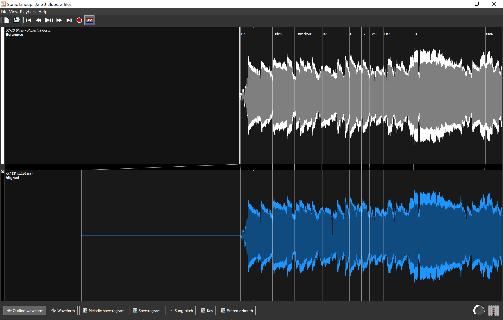
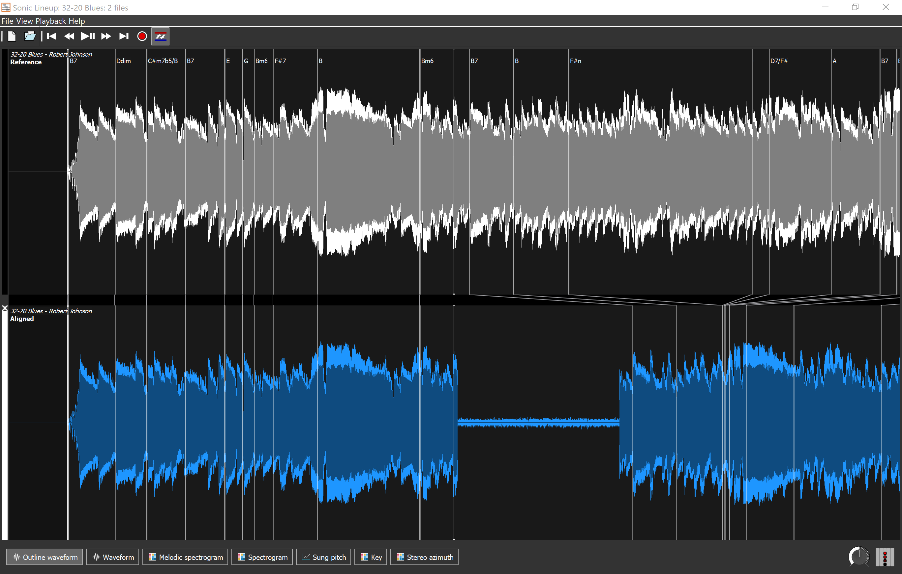

# Save our Sounds – Unlocking our Sound Heritage
### Sonic Lineup | Quick Reference Guide
_June 8th 2020_ 
Tom Ruane
tom.ruane@bl.uk

Sonic Lineup is a lightweight tool used to compare audio files and quickly identify similarities between them. It compares multiple recordings to a single reference file, using a variety of tools to find structural and "musical" matches across the content.

Its parameters are not configurable or designed for detailed analysis; however, it can be useful to quickly compare surrogate copies against original source transfers to identify differences (such as additional content, idents, edits etc.).

After opening the software, go to the top menu bar and select File > Add Files to (you guessed it) add the files to the workspace for comparison.

The waveform of each file will be generated and individually stacked on the timeline. The source file that the comparisons are made against will be at the top, labelled Reference, and subsequent files labelled below as Aligned.

_It is important to confirm the 'source' file you're making the comparisons against is the top Reference, if not, you should clear the session and add the source file first, followed by the surrogate files you want to check._

The default settings will automatically align the files at the start of modulation, ignoring any lead-in silence; comparative files' pitch will also be adjusted to match the source if a difference is detected (indicated on the timeline as "Aligned at (-/+) cents". These options can both be switched off in the Playback menu.

_Figure 1: 10 seconds of lead-in silence detected and files automatically aligned at modulation_

Structurally similar content will be identified by the "Salient Lines" (i.e. the white lines) that run vertically down the aligned files. This is particularly useful to spot where additional content might be in the source but edited out of surrogates, as the lines will adjust along the timeline to match where content is the same. This automatic alignment also works during playback and will skip over any unrelated content so you can quickly identify changes.

_Figure 2: the Salient lines identify where content has been edited out of the surrogate_

The analysis tools are less effective with spoken word material; however, the software should still be able to line up matching content based on its "structure" fairly easily.

_Sonic Lineup is designed with musical content in mind and has several tools that further interrogate these connections (such as chord identification); most of these are not relevant to our work and won't be discussed here._

_Be aware - the analysis can also produce false positives. For example, if you have a piece of audio where the structure has been edited in a non-linear way but has similar repeated sections (e.g. a song), then it will still match the content as it is sonically/structurally similar._

Sonic Lineup can be downloaded here: 
[https://www.sonicvisualiser.org/sonic-lineup/](https://www.sonicvisualiser.org/sonic-lineup/)

Sonic Lineup&#39;s complete reference manual can be found here: 
[https://www.sonicvisualiser.org/sonic-lineup/doc/reference/1.0.1/en/index.html](https://www.sonicvisualiser.org/sonic-lineup/doc/reference/1.0.1/en/index.html)
